# 🔄 Comprehensive Workflow Execution Control - Complete Architectural Plan

## Executive Summary

This document provides the complete architectural plan to fix the executeWorkflow bypass issue and implement retroactive cascade functionality. The solution addresses the root cause where connection-triggered execution bypasses the executeWorkflow flag and provides intelligent workflow resume capabilities.

## 🚨 Root Cause Analysis - SOLVED

### Problem Identified:

**executeWorkflow flag is only checked in `_triggerDownstreamProcessing()` but NOT in the core `processNode()` method**, causing all direct processing calls to bypass workflow control.

### Critical Bypass Locations:

1. **Line 315**: `addConnection()` → `processNode()` (connection-triggered)
2. **Line 211**: `updateNodeData()` → `processNode()` (triggerProcessing=true)
3. **ProcessNew.jsx**: Manual buttons → `processNode()` (should bypass)

## 🏗️ Complete Solution Architecture

### Phase 1: Core executeWorkflow Gate

#### 1.1 Enhanced processNode() Method

**File**: `src/services/nodeDataManager.js`
**Location**: Line 412-434

```javascript
/**
 * Process a node with comprehensive executeWorkflow control
 * @param {string} nodeId - Node ID
 * @param {Object} options - Processing options
 * @param {boolean} options.manual - Bypass executeWorkflow (for manual buttons)
 * @param {boolean} options.force - Force execution regardless of executeWorkflow
 * @param {string} options.source - Source of processing request for logging
 */
async processNode(nodeId, options = {}) {
  console.log(`<core> nodeDataManager: f(processNode) ${nodeId}`, options);
  const nodeData = this.nodes.get(nodeId);
  if (!nodeData) {
    console.warn(`Node ${nodeId} not found for processing`);
    return { status: 'error', reason: 'node_not_found' };
  }

  // Prevent concurrent processing of the same node
  if (this.processingQueue.has(nodeId)) {
    console.log(`<core> nodeDataManager: Node ${nodeId} is already being processed`);
    return { status: 'already_processing' };
  }

  // ✨ CORE FIX: executeWorkflow Gate with bypass options
  const executeWorkflow = this.globalContext?.executeWorkflow ?? true;
  const { manual = false, force = false, source = 'unknown' } = options;
  const isInputNode = nodeData.meta.category === 'input';
  const shouldBypass = manual || force;

  if (!executeWorkflow && !shouldBypass) {
    // Special handling for input nodes - allow processing own data, block downstream
    if (isInputNode) {
      console.log(`<core> nodeDataManager: Input node ${nodeId} processing allowed (user data entry)`);
      // Process input node but prevent downstream cascade in _doProcessNode
      const processingPromise = this._doProcessNode(nodeId, nodeData, { preventDownstream: true });
      this.processingQueue.set(nodeId, processingPromise);

      try {
        const result = await processingPromise;
        return { status: 'completed', result, downstreamBlocked: true };
      } finally {
        this.processingQueue.delete(nodeId);
      }
    } else {
      console.log(`<core> nodeDataManager: ⏸️ Workflow execution paused - skipping processing for ${nodeId} (source: ${source})`);

      // Emit workflow paused event for UI feedback
      this._emitWorkflowPausedEvent(nodeId, source);

      // Mark node as waiting (enhanced status)
      await this.updateNodeData(nodeId, {
        output: {
          meta: {
            status: 'waiting',
            timestamp: new Date().toISOString(),
            pauseReason: 'executeWorkflow_disabled',
            pauseSource: source
          }
        }
      }, false); // Don't trigger processing

      return { status: 'paused', reason: 'executeWorkflow_disabled', source };
    }
  }

  console.log(`<core> nodeDataManager: Executing ${nodeId} (executeWorkflow: ${executeWorkflow}, manual: ${manual}, force: ${force})`);
  const processingPromise = this._doProcessNode(nodeId, nodeData, options);
  this.processingQueue.set(nodeId, processingPromise);

  try {
    const result = await processingPromise;
    return { status: 'completed', result };
  } finally {
    this.processingQueue.delete(nodeId);
  }
}
```

#### 1.2 Enhanced \_doProcessNode() Method

```javascript
/**
 * Internal node processing with downstream control
 * @private
 */
async _doProcessNode(nodeId, nodeData, options = {}) {
  const { preventDownstream = false } = options;

  try {
    // ... existing processing logic ...

    // Process with plugin if configured
    let result = aggregatedInputs;
    if (nodeData.plugin && nodeData.plugin.name) {
      result = await this._processWithPlugin(nodeId, nodeData, aggregatedInputs);
    }

    // Update output data
    await this.updateNodeData(nodeId, {
      output: {
        data: result,
        meta: {
          status: 'success',
          timestamp: new Date().toISOString(),
          processingTime: Date.now() - new Date(nodeData.output.meta.timestamp).getTime()
        }
      }
    });

    // ... directive processing ...

    // Emit processing completed event
    this.dispatchEvent(new CustomEvent(NodeDataEvents.NODE_PROCESSED, {
      detail: { nodeId, result, success: true, downstreamBlocked: preventDownstream }
    }));

    // ✨ ENHANCED: Conditional downstream processing
    if (!preventDownstream) {
      await this._triggerDownstreamProcessing(nodeId);
    } else {
      console.log(`<core> nodeDataManager: Downstream processing blocked for ${nodeId} (executeWorkflow disabled)`);
    }

  } catch (error) {
    // ... existing error handling ...
  }
}
```

#### 1.3 Enhanced Event System

```javascript
/**
 * Enhanced workflow paused event with detailed context
 * @private
 */
_emitWorkflowPausedEvent(nodeId, source = 'unknown') {
  const nodeData = this.nodes.get(nodeId);
  const hasUpstreamData = this._hasUpstreamData(nodeId);

  this.dispatchEvent(new CustomEvent('WORKFLOW_EXECUTION_PAUSED', {
    detail: {
      nodeId,
      timestamp: new Date().toISOString(),
      reason: 'executeWorkflow_disabled',
      source: source, // 'connection', 'manual', 'cascade', 'api'
      canResume: true,
      hasUpstreamData,
      nodeCategory: nodeData?.meta?.category,
      estimatedDownstreamNodes: this._countDownstreamNodes(nodeId)
    }
  }));
}

/**
 * Check if node has upstream data available
 * @private
 */
_hasUpstreamData(nodeId) {
  const nodeData = this.nodes.get(nodeId);
  const connections = nodeData?.input?.connections || {};

  for (const [connectionId, connection] of Object.entries(connections)) {
    const sourceData = this.nodes.get(connection.sourceNodeId);
    if (sourceData?.output?.data && Object.keys(sourceData.output.data).length > 0) {
      return true;
    }
  }
  return false;
}
```

### Phase 2: Enhanced GlobalContext with State Change Callbacks

#### 2.1 Enhanced GlobalContext.jsx

**File**: `src/contexts/GlobalContext.jsx`

```javascript
import React, {
  createContext,
  useContext,
  useState,
  useCallback,
  useRef,
} from "react";

const GlobalContext = createContext();

export const useGlobal = () => {
  const context = useContext(GlobalContext);
  if (!context) {
    throw new Error("useGlobal must be used within a GlobalProvider");
  }
  return context;
};

export const GlobalProvider = ({ children }) => {
  const [executeWorkflow, setExecuteWorkflow] = useState(true);
  const callbacksRef = useRef(new Set());

  // Register callback for executeWorkflow state changes
  const registerExecuteWorkflowCallback = useCallback((callback) => {
    callbacksRef.current.add(callback);
    return () => callbacksRef.current.delete(callback);
  }, []);

  // Enhanced setExecuteWorkflow with callback notifications
  const setExecuteWorkflowEnhanced = useCallback(
    (newValue) => {
      const prevValue = executeWorkflow;
      setExecuteWorkflow(newValue);

      // Notify all registered callbacks of state change
      if (prevValue !== newValue) {
        console.log(
          `<core> GlobalContext: executeWorkflow changed: ${prevValue} → ${newValue}`
        );
        callbacksRef.current.forEach((callback) => {
          try {
            callback(newValue, prevValue);
          } catch (error) {
            console.error("ExecuteWorkflow callback error:", error);
          }
        });
      }
    },
    [executeWorkflow]
  );

  const toggleExecuteWorkflow = useCallback(() => {
    setExecuteWorkflowEnhanced((prev) => !prev);
  }, [setExecuteWorkflowEnhanced]);

  const value = {
    executeWorkflow,
    setExecuteWorkflow: setExecuteWorkflowEnhanced,
    toggleExecuteWorkflow,
    registerExecuteWorkflowCallback,
  };

  return (
    <GlobalContext.Provider value={value}>{children}</GlobalContext.Provider>
  );
};

export default GlobalContext;
```

### Phase 3: Connection-Triggered Execution Control

#### 3.1 Enhanced addConnection() Method

**File**: `src/services/nodeDataManager.js`
**Location**: Line 314-315

```javascript
async addConnection(sourceNodeId, targetNodeId, sourceHandle = 'default', targetHandle = 'default', edgeId) {
  // ... existing connection setup logic ...

  // Emit connection event
  this.dispatchEvent(new CustomEvent(NodeDataEvents.CONNECTION_ADDED, {
    detail: { connectionId, sourceNodeId, targetNodeId, sourceHandle, targetHandle, replaced: !allowMultipleConnections }
  }));

  // ✨ ENHANCED: Connection-triggered execution with proper executeWorkflow control
  const executeWorkflow = this.globalContext?.executeWorkflow ?? true;

  if (executeWorkflow) {
    // Check if source node has data to process
    const sourceData = this.nodes.get(sourceNodeId);
    if (sourceData?.output?.data && Object.keys(sourceData.output.data).length > 0) {
      console.log(`<core> nodeDataManager: ▶️ Connection-triggered execution: processing ${targetNodeId}`);

      // Trigger target processing with connection source context
      const result = await this.processNode(targetNodeId, {
        source: 'connection',
        connectionId,
        sourceNodeId
      });

      if (result.status === 'completed') {
        console.log(`<core> nodeDataManager: ✅ Connection-triggered processing completed for ${targetNodeId}`);
      }
    } else {
      console.log(`<core> nodeDataManager: ⏸️ Connection created but source ${sourceNodeId} has no data to process`);
    }
  } else {
    console.log(`<core> nodeDataManager: ⏸️ Connection created but executeWorkflow is disabled - target ${targetNodeId} will wait`);

    // Mark target node as waiting for workflow execution
    const targetData = this.nodes.get(targetNodeId);
    if (targetData && !targetData.output?.data) {
      await this.updateNodeData(targetNodeId, {
        output: {
          meta: {
            status: 'waiting',
            timestamp: new Date().toISOString(),
            pauseReason: 'executeWorkflow_disabled',
            pauseSource: 'connection',
            waitingFor: sourceNodeId
          }
        }
      }, false);
    }
  }

  console.log(`<core> nodeDataManager: Connection added: ${sourceNodeId} -> ${targetNodeId}`);
}
```

### Phase 4: Retroactive Cascade System

#### 4.1 NodeDataManager Retroactive Methods

**File**: `src/services/nodeDataManager.js`

```javascript
/**
 * Set Global Context and register for executeWorkflow changes
 * @param {Object} globalContext - Global context containing executeWorkflow flag
 */
setGlobalContext(globalContext) {
  this.globalContext = globalContext;

  // Clean up previous subscription
  if (this.executeWorkflowUnsubscribe) {
    this.executeWorkflowUnsubscribe();
  }

  // Register for executeWorkflow state changes
  if (globalContext?.registerExecuteWorkflowCallback) {
    this.executeWorkflowUnsubscribe = globalContext.registerExecuteWorkflowCallback(
      (newValue, prevValue) => this._handleExecuteWorkflowChange(newValue, prevValue)
    );
  }

  console.log('<core> nodeDataManager: ✅ Global context registered with executeWorkflow monitoring');
}

/**
 * Handle executeWorkflow state changes - RETROACTIVE CASCADE TRIGGER
 * @private
 */
async _handleExecuteWorkflowChange(newValue, prevValue) {
  console.log(`<core> nodeDataManager: ExecuteWorkflow changed: ${prevValue} → ${newValue}`);

  // Only trigger retroactive cascade when going from false to true
  if (prevValue === false && newValue === true) {
    console.log('<core> nodeDataManager: 🚀 Triggering retroactive cascade processing...');
    await this._triggerRetroactiveCascade();
  }
}

/**
 * Trigger retroactive cascade for stalled nodes
 * @private
 */
async _triggerRetroactiveCascade() {
  try {
    // Find all nodes with output data that could trigger downstream processing
    const stalledRootNodes = this._findStalledRootNodes();

    if (stalledRootNodes.length === 0) {
      console.log('<core> nodeDataManager: No stalled nodes found for retroactive cascade');
      return;
    }

    console.log(
      `<core> nodeDataManager: Found ${stalledRootNodes.length} stalled root nodes:`,
      stalledRootNodes.map((n) => n.nodeId)
    );

    // Emit retroactive cascade started event
    this.dispatchEvent(new CustomEvent('RETROACTIVE_CASCADE_STARTED', {
      detail: {
        rootNodes: stalledRootNodes.map((n) => n.nodeId),
        timestamp: new Date().toISOString(),
      }
    }));

    // Process each stalled root node which will trigger downstream cascades
    const processingPromises = stalledRootNodes.map(async (rootNode) => {
      console.log(`<core> nodeDataManager: 🎯 Processing stalled root node: ${rootNode.nodeId}`);

      // Trigger processing with retroactive source
      const result = await this.processNode(rootNode.nodeId, {
        source: 'retroactive_cascade',
        force: false // Don't force - let normal executeWorkflow logic apply (should be true now)
      });

      return { nodeId: rootNode.nodeId, result };
    });

    const results = await Promise.all(processingPromises);

    // Emit retroactive cascade completed event
    this.dispatchEvent(new CustomEvent('RETROACTIVE_CASCADE_COMPLETED', {
      detail: {
        processedRootNodes: results.length,
        results: results,
        timestamp: new Date().toISOString(),
      }
    }));

    console.log(`<core> nodeDataManager: ✅ Retroactive cascade completed for ${results.length} root nodes`);

  } catch (error) {
    console.error('<core> nodeDataManager: Retroactive cascade failed:', error);

    // Emit error event
    this.dispatchEvent(new CustomEvent('RETROACTIVE_CASCADE_ERROR', {
      detail: {
        error: error.message,
        timestamp: new Date().toISOString(),
      }
    }));
  }
}

/**
 * Find nodes that have output data but stalled downstream processing
 * @private
 */
_findStalledRootNodes() {
  const stalledRootNodes = [];

  for (const [nodeId, nodeData] of this.nodes) {
    // Check if node has output data
    const hasOutputData = nodeData.output?.data && Object.keys(nodeData.output.data).length > 0;
    if (!hasOutputData) continue;

    // Check if this node has downstream connections
    const hasDownstreamConnections = this._hasDownstreamConnections(nodeId);
    if (!hasDownstreamConnections) continue;

    // Check if downstream nodes are in a "waiting" or "stale" state
    const hasStaleDownstream = this._hasStaleDownstreamNodes(nodeId, nodeData);
    if (hasStaleDownstream) {
      stalledRootNodes.push({ nodeId, nodeData });
    }
  }

  return stalledRootNodes;
}

/**
 * Check if a node has downstream connections
 * @private
 */
_hasDownstreamConnections(nodeId) {
  for (const [connectionId, connection] of this.connections) {
    if (connection.sourceNodeId === nodeId) {
      return true;
    }
  }
  return false;
}

/**
 * Check if downstream nodes are stale (haven't processed recent source data)
 * @private
 */
_hasStaleDownstreamNodes(sourceNodeId, sourceNodeData) {
  const sourceTimestamp = new Date(sourceNodeData.output?.meta?.timestamp || 0).getTime();

  for (const [connectionId, connection] of this.connections) {
    if (connection.sourceNodeId === sourceNodeId) {
      const targetNode = this.nodes.get(connection.targetNodeId);
      if (!targetNode) continue;

      const targetTimestamp = new Date(targetNode.output?.meta?.timestamp || 0).getTime();
      const targetStatus = targetNode.output?.meta?.status;

      // Consider downstream stale if:
      // 1. Target is in "waiting" state (paused by executeWorkflow)
      // 2. Target hasn't been processed at all (no timestamp)
      // 3. Target was processed before source data was updated
      const isStale = targetStatus === 'waiting' ||
                      !targetTimestamp ||
                      targetTimestamp < sourceTimestamp;

      if (isStale) {
        return true;
      }
    }
  }
  return false;
}

/**
 * Get retroactive cascade statistics
 */
getRetroactiveCascadeStats() {
  const stalledNodes = this._findStalledRootNodes();
  const waitingNodes = Array.from(this.nodes.values())
    .filter(node => node.output?.meta?.status === 'waiting');

  return {
    stalledRootNodes: stalledNodes.length,
    stalledNodeIds: stalledNodes.map((n) => n.nodeId),
    waitingNodes: waitingNodes.length,
    waitingNodeIds: waitingNodes.map(node => this._getNodeId(node)),
    totalNodes: this.nodes.size,
    totalConnections: this.connections.size,
    canTriggerRetroactive: stalledNodes.length > 0,
  };
}

// Helper to get node ID from node data
_getNodeId(nodeData) {
  // Find the node ID from the nodes Map
  for (const [nodeId, data] of this.nodes) {
    if (data === nodeData) return nodeId;
  }
  return 'unknown';
}
```

### Phase 5: Integration Updates

#### 5.1 App.jsx Integration Enhancement

**File**: `src/App.jsx`

```javascript
// Enhanced ReactFlowEventHandlers component
function ReactFlowEventHandlers() {
  const globalContext = useGlobal();
  const { executeWorkflow } = globalContext;

  // Initialize NodeDataManager and FlowState integration
  useEffect(() => {
    const initializeIntegration = async () => {
      try {
        await nodeDataManager.initialize();
        console.log("NodeDataManager initialized in ReactFlow component");
      } catch (error) {
        console.error("Failed to initialize integration systems:", error);
      }
    };

    initializeIntegration();
  }, []);

  // ✨ ENHANCED: Wire up complete GlobalContext (not just executeWorkflow value)
  useEffect(() => {
    nodeDataManager.setGlobalContext(globalContext);
    console.log(
      `🔗 Complete GlobalContext wired to NodeDataManager - ExecuteWorkflow: ${executeWorkflow}`
    );
  }, [globalContext, executeWorkflow]);

  // Optional: Listen for retroactive cascade events for UI feedback
  useEffect(() => {
    const handleRetroactiveCascade = (event) => {
      console.log("🔄 Retroactive cascade event:", event.type, event.detail);
      // Could update UI to show cascade progress
    };

    nodeDataManager.addEventListener(
      "RETROACTIVE_CASCADE_STARTED",
      handleRetroactiveCascade
    );
    nodeDataManager.addEventListener(
      "RETROACTIVE_CASCADE_COMPLETED",
      handleRetroactiveCascade
    );
    nodeDataManager.addEventListener(
      "RETROACTIVE_CASCADE_ERROR",
      handleRetroactiveCascade
    );

    return () => {
      nodeDataManager.removeEventListener(
        "RETROACTIVE_CASCADE_STARTED",
        handleRetroactiveCascade
      );
      nodeDataManager.removeEventListener(
        "RETROACTIVE_CASCADE_COMPLETED",
        handleRetroactiveCascade
      );
      nodeDataManager.removeEventListener(
        "RETROACTIVE_CASCADE_ERROR",
        handleRetroactiveCascade
      );
    };
  }, []);

  return null;
}
```

#### 5.2 ProcessNew.jsx Manual Button Enhancement

**File**: `src/components/ProcessNew.jsx`

```javascript
// Enhanced manual processing with proper bypass
const handleProcessClick = async () => {
  try {
    setIsProcessing(true);

    // Manual button should ALWAYS work regardless of executeWorkflow
    const result = await nodeDataManager.processNode(id, {
      manual: true,
      source: "manual_button",
    });

    if (result.status === "completed") {
      console.log(`✅ Manual processing completed for ${id}`);
    } else if (result.status === "paused") {
      console.log(`⏸️ Processing paused for ${id}: ${result.reason}`);
    }
  } catch (error) {
    console.error(`❌ Manual processing failed for ${id}:`, error);
  } finally {
    setIsProcessing(false);
  }
};
```

## 🧪 Complete Testing Strategy

### Unit Tests Required

```javascript
// src/__tests__/executeWorkflowControl.test.js
describe("ExecuteWorkflow Control System", () => {
  test("processNode respects executeWorkflow=false", async () => {
    // Test core executeWorkflow gate
  });

  test("manual processing bypasses executeWorkflow", async () => {
    // Test manual button bypass
  });

  test("input nodes can process with executeWorkflow=false", async () => {
    // Test input node special handling
  });

  test("connection-triggered execution respects executeWorkflow", async () => {
    // Test addConnection behavior
  });

  test("retroactive cascade triggers when executeWorkflow changes to true", async () => {
    // Test retroactive cascade system
  });
});
```

### Integration Test Scenarios

1. **Scenario A**: Connect nodes when executeWorkflow = false
   - Expected: Target node enters 'waiting' state, no execution
2. **Scenario B**: Connect nodes when executeWorkflow = true
   - Expected: Target node executes immediately if source has data
3. **Scenario C**: Toggle executeWorkflow from false to true
   - Expected: All waiting nodes process automatically via retroactive cascade

## 📊 Execution Flow Diagrams

### Before Fix (Current Issue)

```mermaid
sequenceDiagram
    participant User
    participant UI
    participant GlobalContext
    participant NodeDataManager
    participant ProcessNode

    Note over GlobalContext: executeWorkflow = false
    User->>UI: Drag connection FormNode → ProcessNode
    UI->>NodeDataManager: addConnection()
    NodeDataManager->>ProcessNode: processNode() ❌ NO CHECK
    ProcessNode->>ProcessNode: Execute plugin logic ❌ BYPASSED
    Note over ProcessNode: Executes despite executeWorkflow = false
```



### After Fix (Solution)

```mermaid
sequenceDiagram
    participant User
    participant UI
    participant GlobalContext
    participant NodeDataManager
    participant ProcessNode

    Note over GlobalContext: executeWorkflow = false
    User->>UI: Drag connection FormNode → ProcessNode
    UI->>NodeDataManager: addConnection()
    NodeDataManager->>NodeDataManager: Check executeWorkflow ✅
    NodeDataManager->>ProcessNode: Mark as 'waiting' ✅
    Note over ProcessNode: Waits for executeWorkflow = true

    User->>GlobalContext: Toggle executeWorkflow = true
    GlobalContext->>NodeDataManager: State change callback ✅
    NodeDataManager->>NodeDataManager: Find stalled nodes ✅
    NodeDataManager->>ProcessNode: processNode() ✅
    ProcessNode->>ProcessNode: Execute plugin logic ✅
```



## 🎯 Implementation Priority

1. **HIGH**: Core executeWorkflow gate in processNode()
2. **HIGH**: Enhanced GlobalContext with callbacks
3. **MEDIUM**: Connection control in addConnection()
4. **MEDIUM**: Retroactive cascade system
5. **LOW**: Enhanced events and UI feedback

## ✅ Success Criteria

- [ ] Connection-triggered execution respects executeWorkflow flag
- [ ] Manual process buttons always work (bypass executeWorkflow)
- [ ] Input nodes can process user data even when executeWorkflow = false
- [ ] Retroactive cascade automatically processes waiting nodes
- [ ] All existing functionality remains unchanged
- [ ] Comprehensive event system for UI feedback
- [ ] Complete test coverage for all scenarios

## 🚀 Ready for Implementation

This comprehensive plan addresses the root cause of the executeWorkflow bypass issue while implementing the complete retroactive cascade system. The solution is designed to be:

- **Backward Compatible**: All existing code continues to work
- **Configurable**: Multiple bypass options for different use cases
- **Intelligent**: Automatic stalled node detection and processing
- **Observable**: Rich event system for UI integration
- **Testable**: Clear interfaces and separation of concerns

The implementation can now proceed in code mode with this complete architectural blueprint.
