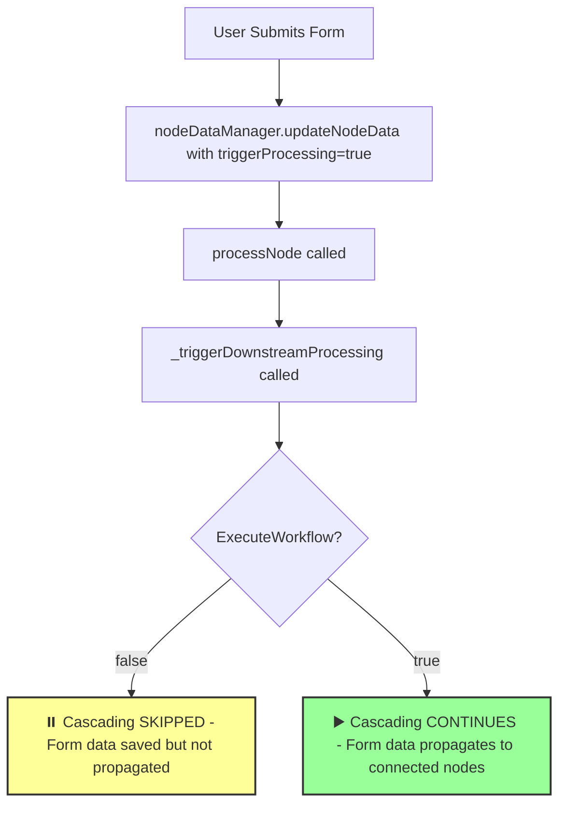
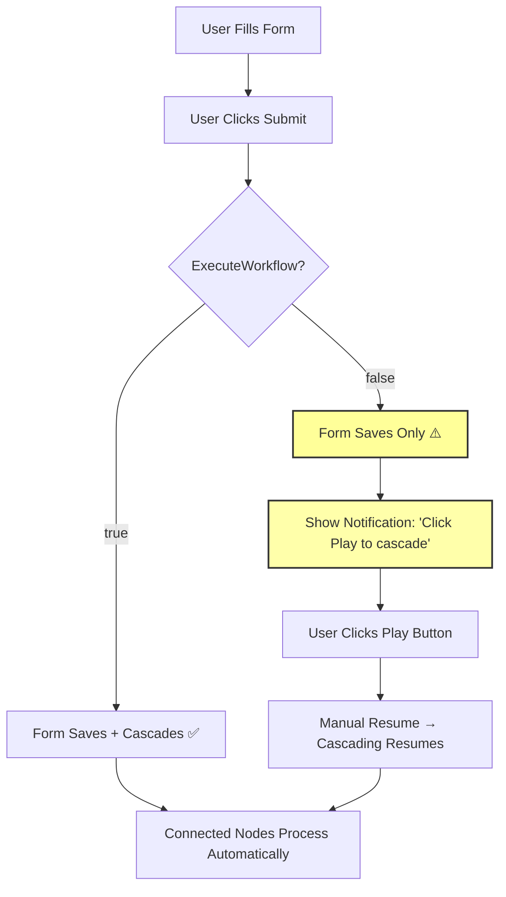

# 🎯 Form Nodes & ExecuteWorkflow Behavior Analysis

## Critical Design Question

**What happens when `ExecuteWorkflow = false` and a user submits a form?**

This is a fundamental UX decision that affects how users interact with the workflow system.

## Current Implementation Analysis

### Code Flow for Form Submission

Looking at [`templateFormNode.jsx:218-228`](src/components/templateFormNode.jsx:218-228):

```javascript
// Update with actual data
await nodeDataManager.updateNodeData(
  nodeId,
  {
    output: {
      data: formData,
      meta: {
        timestamp: new Date().toISOString(),
        status: "success",
        dataSize: JSON.stringify(formData).length,
      },
    },
  },
  true
); // ← KEY: triggerProcessing = true
```

### What Currently Happens



## 🚨 Current Behavior (As Implemented)

### When ExecuteWorkflow = false:

1. ✅ **Form data is saved** to the form node
2. ✅ **Form node shows success status**
3. ❌ **Connected nodes do NOT process** the new form data
4. ❌ **Workflow chain is broken** until user clicks Play

### When ExecuteWorkflow = true:

1. ✅ **Form data is saved** to the form node
2. ✅ **Connected nodes automatically process** the new data
3. ✅ **Full workflow cascade happens**

## 🎨 Visual Indicators in Form Node

The form node already shows execution status:

```javascript
// Lines 318-321 in templateFormNode.jsx
<div
  className={`w-3 h-3 rounded-full ${
    executeWorkflow ? "bg-green-500" : "bg-red-500"
  }`}
  title={`Execution: ${executeWorkflow ? "Enabled" : "Disabled"}`}
/>
```

## 🤔 Design Options & Trade-offs

### **Option A: Current Implementation** _(Consistent Behavior)_

**Behavior**: Form submissions respect ExecuteWorkflow flag

```javascript
// Already implemented - no changes needed
```

**Pros:**

- ✅ Consistent behavior across all node types
- ✅ When paused, everything is paused
- ✅ Clear visual feedback to users
- ✅ No special cases in code

**Cons:**

- ❌ User might expect form submission to "always work"
- ❌ Could be confusing if user doesn't notice execution is paused
- ❌ Requires user to manually resume execution

---

### **Option B: User-Initiated Override** _(Smart Behavior)_

**Behavior**: Form submissions always cascade, regardless of ExecuteWorkflow

```javascript
// Modify templateFormNode.jsx submission handler
const isUserInitiated = true;
await nodeDataManager.updateNodeData(nodeId, updates, triggerProcessing, { userInitiated: isUserInitiated });

// Modify NodeDataManager._triggerDownstreamProcessing
async _triggerDownstreamProcessing(nodeId, options = {}) {
  const executeWorkflow = this.globalContext?.executeWorkflow ?? true;

  // User-initiated actions always cascade
  if (!executeWorkflow && !options.userInitiated) {
    console.log(`⏸️ Workflow paused - skipping cascade for ${nodeId}`);
    return;
  }

  if (!executeWorkflow && options.userInitiated) {
    console.log(`👤 User-initiated action - overriding pause for ${nodeId}`);
  }

  // Continue with cascading...
}
```

**Pros:**

- ✅ User actions always work as expected
- ✅ Distinguishes between automatic and manual triggers
- ✅ Better user experience for form interactions

**Cons:**

- ❌ More complex logic and edge cases
- ❌ Inconsistent behavior (some cascades work, others don't)
- ❌ Could be confusing when some things cascade and others don't

---

### **Option C: Confirmation Dialog** _(Interactive Behavior)_

**Behavior**: Ask user whether to cascade when ExecuteWorkflow=false

```javascript
// In templateFormNode.jsx
if (!executeWorkflow) {
  const shouldCascade = await showConfirmDialog({
    title: "Workflow Execution Paused",
    message: "Execute connected nodes with this new data?",
    options: ["Execute Once", "Cancel", "Resume All Execution"],
  });

  if (shouldCascade === "Resume All") {
    toggleExecuteWorkflow(); // Resume global execution
  }

  const triggerProcessing = shouldCascade !== "Cancel";
  await nodeDataManager.updateNodeData(nodeId, updates, triggerProcessing);
} else {
  // Normal processing when execution enabled
  await nodeDataManager.updateNodeData(nodeId, updates, true);
}
```

**Pros:**

- ✅ User has full control over each form submission
- ✅ Can resume global execution if desired
- ✅ Clear communication of what's happening

**Cons:**

- ❌ Interrupts user workflow with dialogs
- ❌ More complex implementation
- ❌ Could be annoying for frequent form submissions

## 🎯 Recommended Approach

### **Recommendation: Stick with Option A (Current Implementation)**

**Reasoning:**

1. **🎯 Simplicity**: Clear, consistent behavior - when paused, everything is paused
2. **🔍 Visibility**: Form node shows execution status indicator
3. **⚡ Control**: User has immediate control via WorkflowFAB play/pause button
4. **📝 Predictable**: No special cases or exceptions to remember

### **Enhanced UX Improvements**

Instead of changing the core behavior, enhance user feedback:

```javascript
// Add to templateFormNode.jsx submission handler
const handleFormSubmit = async (formData) => {
  if (!executeWorkflow) {
    // Show temporary toast/notification
    showNotification({
      type: "info",
      message:
        "Form saved! Workflow execution is paused. Click Play to cascade changes.",
      action: { label: "Resume", onClick: toggleExecuteWorkflow },
    });
  }

  // Continue with normal submission...
  await nodeDataManager.updateNodeData(nodeId, updates, true);
};
```

## 📊 User Experience Flow



## 🧪 Testing Form Node Behavior

Current test coverage should include:

```javascript
// Test: Form submission with ExecuteWorkflow = false
test("form submission respects ExecuteWorkflow flag", async () => {
  const formNode = createFormNode();
  const processNode = createProcessNode();

  // Connect form → process
  await nodeDataManager.addConnection(formNode.id, processNode.id);

  // Set ExecuteWorkflow = false
  nodeDataManager.setGlobalContext({ executeWorkflow: false });

  // Submit form
  await formNode.submitForm({ name: "test" });

  // Form node should be updated
  expect(formNode.output.data).toEqual({ name: "test" });

  // Process node should NOT be triggered
  expect(processNode.lastProcessedTime).toBeNull();
});
```

## 🎉 Conclusion

**The current implementation (Option A) is the right approach** because:

- ✅ **Consistent & Predictable**: When execution is paused, it's truly paused
- ✅ **Clear Visual Feedback**: Users can see execution status on each node
- ✅ **Simple Control**: One button controls entire workflow execution
- ✅ **No Edge Cases**: No special handling needed

The key is ensuring users understand the execution state through clear visual indicators and helpful notifications.
