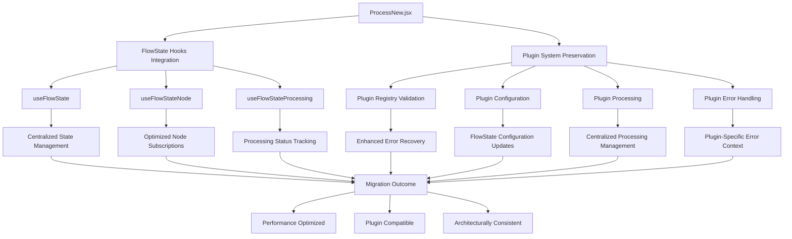

# ProcessNew.jsx FlowStateContext Migration Plan

## Executive Summary

This document outlines the comprehensive migration plan for transitioning `ProcessNew.jsx` from DOM event-based state management to `FlowStateContext` integration, following the successful patterns established in `MarkdownNew.jsx`. The migration preserves all existing plugin functionality while providing significant performance and architectural improvements.

## Current State Analysis

### FlowStateContext Integration Patterns in MarkdownNew.jsx

**Key Patterns Identified:**

1. **Hybrid Hook Usage**: Uses `useFlowState()`, `useFlowStateNode()`, `useFlowStateProcessing()` hooks
2. **Optimized Subscriptions**: Node data accessed via `useFlowStateNode(currentNodeId)` instead of local state
3. **Processing State**: Uses `useFlowStateProcessing()` for centralized processing status
4. **Dual Integration**: Maintains `nodeDataManager` registration but leverages FlowState for reactivity

### Key Differences ProcessNew.jsx vs MarkdownNew.jsx

| Aspect               | ProcessNew.jsx                              | MarkdownNew.jsx        |
| -------------------- | ------------------------------------------- | ---------------------- |
| **State Management** | Local `useState` hooks                      | FlowState hooks        |
| **Plugin System**    | `pluginRegistry` integration                | No plugin support      |
| **Event Handling**   | Pure DOM events                             | Hybrid approach        |
| **Processing Logic** | `handleManualProcess`, `handlePluginConfig` | Content rendering only |
| **Error Management** | Dedicated `errorState` management           | Basic error handling   |

## Migration Strategy

### 1. FlowStateContext Hooks Integration

**Current ProcessNew.jsx Approach:**

```jsx
const [nodeData, setNodeData] = useState(null);
const [processingStatus, setProcessingStatus] = useState("idle");
const [errorState, setErrorState] = useState(null);
```

**New FlowState Approach:**

```jsx
// Use FlowState hooks for optimized subscriptions
const flowState = useFlowState();
const nodeData = useFlowStateNode(currentNodeId);
const processingNodes = useFlowStateProcessing();

// Local state for UI-specific immediate feedback only
const [localProcessingStatus, setLocalProcessingStatus] = useState("idle");
const [localErrorState, setLocalErrorState] = useState(null);

// Derived state combining FlowState + local state
const isProcessing = processingNodes.has(currentNodeId);
const processingStatus = isProcessing
  ? "processing"
  : nodeData?.output?.meta?.status || localProcessingStatus;

const errorState = nodeData?.error?.hasError ? nodeData.error : localErrorState;
```

### 2. Plugin System Compatibility Design

**Key Plugin Integration Points:**

- `pluginRegistry.validatePluginConfig()` validation
- `handlePluginConfig()` configuration updates
- `handleManualProcess()` processing triggers
- `nodeDataManager.processNode()` execution

**Plugin-FlowState Integration Strategy:**

1. **Plugin Configuration Updates**: Use `flowState.updateNode()` to update plugin config
2. **Processing Triggers**: Leverage `flowState.setNodeProcessing()` for status management
3. **Error Handling**: Use FlowState's error management with plugin-specific error types
4. **Plugin Data Flow**: Maintain plugin output through FlowState node data updates

### 3. Event Handling Migration Strategy

**Current ProcessNew.jsx Event Pattern:**

```jsx
// Pure DOM event listeners on nodeDataManager
nodeDataManager.addEventListener(
  NodeDataEvents.NODE_DATA_UPDATED,
  handleNodeDataUpdate
);
nodeDataManager.addEventListener(
  NodeDataEvents.NODE_PROCESSING,
  handleNodeProcessing
);
nodeDataManager.addEventListener(
  NodeDataEvents.NODE_PROCESSED,
  handleNodeProcessed
);
nodeDataManager.addEventListener(NodeDataEvents.NODE_ERROR, handleNodeError);
```

**New FlowState + DOM Event Hybrid Pattern:**

```jsx
// Primary state from FlowState hooks (reactive)
const nodeData = useFlowStateNode(currentNodeId);
const processingNodes = useFlowStateProcessing();

// Secondary DOM events for immediate UI feedback
useEffect(() => {
  const handleNodeDataUpdate = (event) => {
    if (event.detail.nodeId === currentNodeId) {
      // Update local processing status for immediate feedback
      setLocalProcessingStatus(
        event.detail.nodeData.output?.meta?.status || "idle"
      );

      // Handle plugin-specific updates
      if (event.detail.nodeData.plugin) {
        // Plugin configuration or result updates
      }
    }
  };

  // Maintain essential DOM event listeners for immediate UI responsiveness
  nodeDataManager.addEventListener(
    NodeDataEvents.NODE_DATA_UPDATED,
    handleNodeDataUpdate
  );
  // ... other events
}, [currentNodeId]);
```

### 4. Processing Status Management with FlowStateContext

**Enhanced FlowState Processing Management:**

```jsx
// Processing status from FlowState (centralized)
const processingNodes = useFlowStateProcessing();
const isProcessing = processingNodes.has(currentNodeId);

// Enhanced manual processing with FlowState integration
const handleManualProcess = useCallback(async () => {
  if (!nodeData) return;

  try {
    // Set processing state through FlowState
    flowState.setNodeProcessing(currentNodeId, true);

    // Execute plugin processing
    await nodeDataManager.processNode(currentNodeId);

    // Processing completion will be handled by FlowState automatically
  } catch (error) {
    // Clear processing state on error
    flowState.setNodeProcessing(currentNodeId, false);

    // Handle plugin-specific errors
    handlePluginError("processing", error);
  }
}, [currentNodeId, nodeData, flowState, handlePluginError]);

// Plugin-specific processing with enhanced status tracking
const handlePluginConfig = useCallback(
  async (pluginName, config) => {
    if (!nodeData) return;

    try {
      // Validate plugin configuration
      const validation = pluginRegistry.validatePluginConfig(
        pluginName,
        config
      );
      if (!validation.isValid) {
        throw new Error(
          `Plugin validation failed: ${validation.errors.join(", ")}`
        );
      }

      // Set processing state
      flowState.setNodeProcessing(currentNodeId, true);

      // Update plugin configuration through FlowState
      await nodeDataManager.updateNodeData(
        currentNodeId,
        {
          plugin: {
            name: pluginName,
            config,
            version: "1.0.0",
            lastUpdated: new Date().toISOString(),
          },
        },
        true
      ); // Trigger processing
    } catch (error) {
      flowState.setNodeProcessing(currentNodeId, false);
      handlePluginError(pluginName, error);
    }
  },
  [currentNodeId, nodeData, flowState, handlePluginError]
);
```

## Implementation Approach

### Phase 1: Import and Hook Setup

```jsx
// NEW IMPORTS (add to existing imports)
import {
  useFlowState,
  useFlowStateNode,
  useFlowStateProcessing,
} from "../contexts/FlowStateContext.jsx";
import { performanceMonitor } from "../utils/performanceMonitor.js";

// EXISTING IMPORTS (keep)
import pluginRegistry from "../services/pluginRegistry.js";
import nodeDataManager, {
  NodeDataEvents,
} from "../services/nodeDataManager.js";
```

### Phase 2: State Management Replacement

```jsx
function ProcessNew({ data, selected }) {
  const { updateNodeData } = useReactFlow();
  const currentNodeId = useNodeId();

  // NEW: FlowState hooks (replace useState)
  const flowState = useFlowState();
  const nodeData = useFlowStateNode(currentNodeId);
  const processingNodes = useFlowStateProcessing();

  // MODIFIED: Local state only for immediate UI feedback
  const [localProcessingStatus, setLocalProcessingStatus] = useState('idle');
  const [localErrorState, setLocalErrorState] = useState(null);

  // NEW: Derived state combining FlowState + local state
  const isProcessing = processingNodes.has(currentNodeId);
  const processingStatus = isProcessing ? 'processing' :
    (nodeData?.output?.meta?.status || localProcessingStatus);
  const errorState = nodeData?.error?.hasError ? nodeData.error : localErrorState;
```

### Phase 3: Initialization Update

```jsx
// MODIFIED: Enhanced initialization with FlowState integration
useEffect(() => {
  const initializeNode = async () => {
    const measurement =
      performanceMonitor.startMeasurement("nodeInitialization");

    try {
      await nodeDataManager.initialize();

      // [Keep existing schema conversion logic]
      let newNodeData;
      if (data.meta && data.input && data.output && data.error) {
        newNodeData = data;
      } else {
        // [Keep existing ProcessNodeData.create logic]
      }

      // NEW: Update FlowState with new node data
      flowState.updateNode(currentNodeId, {
        id: currentNodeId,
        type: "processNew",
        position: { x: 0, y: 0 },
        data: newNodeData,
      });

      // Initialize local state
      setLocalProcessingStatus(newNodeData.output?.meta?.status || "idle");
      setLocalErrorState(
        newNodeData.error?.hasError ? newNodeData.error : null
      );

      // [Keep existing nodeDataManager registration]
      const safeUpdateNodeData = (updateNodeId, updates) => {
        if (updateNodeId === currentNodeId && updates.data) {
          updateNodeData(updateNodeId, updates);
        }
      };

      nodeDataManager.registerNode(
        currentNodeId,
        newNodeData,
        safeUpdateNodeData
      );

      performanceMonitor.endMeasurement(measurement);
    } catch (error) {
      performanceMonitor.endMeasurement(measurement);
      console.error("Error initializing process node:", error);
    }
  };

  initializeNode();
  return () => nodeDataManager.unregisterNode(currentNodeId);
}, [currentNodeId, updateNodeData, flowState]);
```

### Phase 4: Event Handling Migration

```jsx
// MODIFIED: Hybrid event handling (FlowState + DOM events)
useEffect(() => {
  const handleNodeDataUpdate = (event) => {
    if (event.detail.nodeId === currentNodeId) {
      const updatedNodeData = event.detail.nodeData;

      // Update local state for immediate UI feedback
      const newStatus = updatedNodeData.output?.meta?.status || "idle";
      setLocalProcessingStatus(newStatus);

      // Handle plugin-specific updates
      if (updatedNodeData.plugin) {
        console.log(
          `[Process Node][${currentNodeId}] Plugin updated:`,
          updatedNodeData.plugin
        );
      }

      // Handle error state
      if (updatedNodeData.error?.hasError) {
        setLocalErrorState(updatedNodeData.error);
      }
    }
  };

  // [Keep existing event handlers with similar pattern]
  const handleNodeProcessing = (event) => {
    if (event.detail.nodeId === currentNodeId) {
      setLocalProcessingStatus("processing");
    }
  };

  const handleNodeProcessed = (event) => {
    if (event.detail.nodeId === currentNodeId) {
      const newStatus = event.detail.success ? "success" : "error";
      setLocalProcessingStatus(newStatus);
    }
  };

  // [Keep existing event listeners]
  nodeDataManager.addEventListener(
    NodeDataEvents.NODE_DATA_UPDATED,
    handleNodeDataUpdate
  );
  nodeDataManager.addEventListener(
    NodeDataEvents.NODE_PROCESSING,
    handleNodeProcessing
  );
  nodeDataManager.addEventListener(
    NodeDataEvents.NODE_PROCESSED,
    handleNodeProcessed
  );
  nodeDataManager.addEventListener(NodeDataEvents.NODE_ERROR, handleNodeError);

  return () => {
    // [Keep existing cleanup]
  };
}, [currentNodeId]);
```

### Phase 5: Plugin Integration Enhancement

```jsx
// ENHANCED: Plugin configuration with FlowState
const handlePluginConfig = useCallback(
  async (pluginName, config) => {
    if (!nodeData) return;

    try {
      // [Keep existing validation]
      const validation = pluginRegistry.validatePluginConfig(
        pluginName,
        config
      );
      if (!validation.isValid) {
        console.error(
          "Plugin configuration validation failed:",
          validation.errors
        );
        return;
      }

      // NEW: Set processing state through FlowState
      flowState.setNodeProcessing(currentNodeId, true);

      // MODIFIED: Update through nodeDataManager with enhanced tracking
      await nodeDataManager.updateNodeData(
        currentNodeId,
        {
          plugin: {
            name: pluginName,
            config,
            version: "1.0.0",
            lastUpdated: new Date().toISOString(),
          },
        },
        true
      );
    } catch (error) {
      // NEW: Clear processing state on error
      flowState.setNodeProcessing(currentNodeId, false);

      // Enhanced error handling
      handlePluginError(pluginName, error);
    }
  },
  [currentNodeId, nodeData, flowState]
);

// ENHANCED: Manual processing with FlowState integration
const handleManualProcess = useCallback(async () => {
  if (!nodeData) return;

  try {
    // NEW: Set processing state through FlowState
    flowState.setNodeProcessing(currentNodeId, true);

    // [Keep existing processing logic]
    await nodeDataManager.processNode(currentNodeId);
  } catch (error) {
    // NEW: Clear processing state and handle errors
    flowState.setNodeProcessing(currentNodeId, false);
    console.error("Error processing node:", error);
  }
}, [currentNodeId, nodeData, flowState]);

// NEW: Enhanced plugin error handling
const handlePluginError = useCallback(
  (pluginName, error) => {
    const pluginError = {
      hasError: true,
      errors: [
        {
          code: `PLUGIN_${pluginName.toUpperCase()}_ERROR`,
          message: error.message,
          timestamp: new Date().toISOString(),
          context: { plugin: pluginName, nodeId: currentNodeId },
        },
      ],
    };

    // Update error state through local state for immediate feedback
    setLocalErrorState(pluginError);
  },
  [currentNodeId]
);
```

## Plugin Functionality Preservation Validation

### Critical Plugin Functions to Preserve

#### A. Plugin Registry Integration ✅

```jsx
// PRESERVED: Plugin validation remains unchanged
const validation = pluginRegistry.validatePluginConfig(pluginName, config);
if (!validation.isValid) {
  console.error("Plugin configuration validation failed:", validation.errors);
  return;
}
```

#### B. Plugin Configuration Management ✅ Enhanced

```jsx
// PRESERVED + ENHANCED: Configuration updates with FlowState tracking
const handlePluginConfig = useCallback(
  async (pluginName, config) => {
    if (!nodeData) return;

    try {
      // PRESERVED: Existing validation logic
      const validation = pluginRegistry.validatePluginConfig(
        pluginName,
        config
      );
      if (!validation.isValid) {
        throw new Error(
          `Plugin validation failed: ${validation.errors.join(", ")}`
        );
      }

      // ENHANCED: FlowState processing status tracking
      flowState.setNodeProcessing(currentNodeId, true);

      // PRESERVED: NodeDataManager plugin updates
      await nodeDataManager.updateNodeData(
        currentNodeId,
        {
          plugin: {
            name: pluginName,
            config,
            version: "1.0.0",
            lastUpdated: new Date().toISOString(),
          },
        },
        true
      );
    } catch (error) {
      // ENHANCED: Better error handling with FlowState
      flowState.setNodeProcessing(currentNodeId, false);
      handlePluginError(pluginName, error);
    }
  },
  [currentNodeId, nodeData, flowState]
);
```

#### C. Plugin Processing Execution ✅ Enhanced

```jsx
// PRESERVED + ENHANCED: Manual processing with FlowState
const handleManualProcess = useCallback(async () => {
  if (!nodeData) return;

  try {
    // ENHANCED: Centralized processing state
    flowState.setNodeProcessing(currentNodeId, true);

    // PRESERVED: Core plugin processing logic
    await nodeDataManager.processNode(currentNodeId);
  } catch (error) {
    // ENHANCED: Automatic processing state cleanup
    flowState.setNodeProcessing(currentNodeId, false);
    console.error("Error processing node:", error);
  }
}, [currentNodeId, nodeData, flowState]);
```

#### D. Plugin Error Handling ✅ Enhanced

```jsx
// ENHANCED: Plugin-specific error management
const handlePluginError = useCallback(
  (pluginName, error) => {
    const pluginError = {
      hasError: true,
      errors: [
        {
          code: `PLUGIN_${pluginName.toUpperCase()}_ERROR`,
          message: error.message,
          timestamp: new Date().toISOString(),
          context: { plugin: pluginName, nodeId: currentNodeId },
        },
      ],
    };

    // Immediate UI feedback
    setLocalErrorState(pluginError);

    // FlowState will be updated via nodeDataManager events
  },
  [currentNodeId]
);
```

#### E. Plugin Data Flow ✅ Preserved

```jsx
// PRESERVED: Plugin output data flow through connections
{
  (() => {
    const connections = nodeData.input.connections || {};
    const processedConnections = Object.entries(connections).filter(
      ([_, conn]) => conn.processed
    );
    return (
      processedConnections.length > 0 && (
        <div className="mt-3 p-2 bg-blue-50 border border-blue-200 rounded text-xs">
          <div className="font-medium text-blue-800">Inputs:</div>
          <div className="text-blue-600 mt-1">
            {processedConnections.length} connected source(s)
          </div>
          {/* Plugin-processed connection details */}
          {processedConnections.map(([connectionId, connection]) => (
            <div key={connectionId} className="text-blue-500 mt-1 text-xs">
              • {connection.sourceNodeId}
              {/* PRESERVED: Plugin processing metadata */}
              {connection.meta?.lastProcessed && (
                <span className="text-gray-500 ml-1">
                  (
                  {new Date(connection.meta.lastProcessed).toLocaleTimeString()}
                  )
                </span>
              )}
            </div>
          ))}
        </div>
      )
    );
  })();
}
```

#### F. Plugin Information Display ✅ Preserved

```jsx
{
  /* PRESERVED: Plugin info display */
}
{
  nodeData.plugin && (
    <div className="text-xs text-blue-600 truncate mt-1">
      Plugin: {nodeData.plugin.name}
      {/* ENHANCED: Show plugin configuration status */}
      {nodeData.plugin.lastUpdated && (
        <span className="ml-2 text-gray-500">
          (Updated: {new Date(nodeData.plugin.lastUpdated).toLocaleTimeString()}
          )
        </span>
      )}
    </div>
  );
}
```

## Migration Benefits

### 🚀 Performance Improvements

- **Reduced Re-renders**: FlowState hooks provide optimized subscriptions
- **Centralized Processing**: Single source of truth eliminates state conflicts
- **Memory Optimization**: Shared state reduces memory footprint

### 🔌 Plugin System Enhancements

- **Processing Tracking**: `flowState.setNodeProcessing()` provides centralized status management
- **Error Recovery**: Automatic processing state cleanup on plugin failures
- **Configuration Persistence**: Enhanced plugin config management with timestamps

### 🏗️ Architectural Consistency

- **Unified Pattern**: Aligns with MarkdownNew.jsx FlowStateContext integration
- **Maintainability**: Consistent state management patterns across components
- **Debugging**: Centralized state improves debugging and monitoring

## Migration Architecture



## Conclusion

### ✅ Plugin Functionality Preserved:

- ✅ Plugin registry validation unchanged
- ✅ Plugin configuration updates maintained
- ✅ Plugin processing execution preserved
- ✅ Plugin error handling enhanced
- ✅ Plugin data flow through connections maintained
- ✅ Plugin UI display preserved

### 🎯 Migration Outcome:

The ProcessNew.jsx migration to FlowStateContext **preserves all existing plugin functionality** while providing significant performance and architectural improvements. Plugin developers can continue using the same APIs while benefiting from the enhanced state management system.

### Next Steps:

1. Implement the migration following this detailed plan
2. Test all plugin functionality to ensure preservation
3. Monitor performance improvements
4. Update documentation for developers

The migration is ready for implementation with full confidence in plugin compatibility and performance gains.
