# 🔄 Retroactive Cascade Trigger Implementation

## Problem Statement

When a workflow initially has `executeWorkflow = false`:

1. **User submits form data** → FormNode processes and stores data
2. **Downstream processing is blocked** → ProcessNode and OutputNode remain idle
3. **User toggles executeWorkflow = true** → System should automatically cascade the existing data
4. **Current Gap**: No mechanism triggers retroactive processing of stalled nodes

## Solution Architecture

### Core Components

#### 1. **ExecuteWorkflow State Change Detection**

- Monitor `executeWorkflow` state transitions in GlobalContext
- Trigger retroactive cascade when transitioning from `false` to `true`

#### 2. **Stalled Node Detection**

- Identify nodes with output data but unprocessed downstream connections
- Determine root nodes that can trigger cascade chains

#### 3. **Retroactive Cascade Processing**

- Process nodes in topological order
- Respect existing connection dependencies
- Avoid duplicate processing

## Implementation Details

### Step 1: Enhanced GlobalContext with State Change Callbacks

```javascript
// src/contexts/GlobalContext.jsx - Enhanced Version
import React, {
  createContext,
  useContext,
  useState,
  useCallback,
  useRef,
} from "react";

const GlobalContext = createContext();

export const useGlobal = () => {
  const context = useContext(GlobalContext);
  if (!context) {
    throw new Error("useGlobal must be used within a GlobalProvider");
  }
  return context;
};

export const GlobalProvider = ({ children }) => {
  const [executeWorkflow, setExecuteWorkflow] = useState(true);
  const callbacksRef = useRef(new Set());

  // Register callback for executeWorkflow state changes
  const registerExecuteWorkflowCallback = useCallback((callback) => {
    callbacksRef.current.add(callback);
    return () => callbacksRef.current.delete(callback);
  }, []);

  const setExecuteWorkflowEnhanced = useCallback(
    (newValue) => {
      const prevValue = executeWorkflow;
      setExecuteWorkflow(newValue);

      // Notify all registered callbacks of state change
      if (prevValue !== newValue) {
        callbacksRef.current.forEach((callback) => {
          try {
            callback(newValue, prevValue);
          } catch (error) {
            console.error("ExecuteWorkflow callback error:", error);
          }
        });
      }
    },
    [executeWorkflow]
  );

  const toggleExecuteWorkflow = useCallback(() => {
    setExecuteWorkflowEnhanced((prev) => !prev);
  }, [setExecuteWorkflowEnhanced]);

  const value = {
    executeWorkflow,
    setExecuteWorkflow: setExecuteWorkflowEnhanced,
    toggleExecuteWorkflow,
    registerExecuteWorkflowCallback,
  };

  return (
    <GlobalContext.Provider value={value}>{children}</GlobalContext.Provider>
  );
};

export default GlobalContext;
```

### Step 2: Enhanced NodeDataManager with Retroactive Cascade

```javascript
// src/services/nodeDataManager.js - Add these methods

class NodeDataManager extends EventTarget {
  constructor() {
    super();
    // ... existing constructor code
    this.executeWorkflowUnsubscribe = null;
  }

  /**
   * Set Global Context and register for executeWorkflow changes
   * @param {Object} globalContext - Global context containing executeWorkflow flag
   */
  setGlobalContext(globalContext) {
    this.globalContext = globalContext;

    // Clean up previous subscription
    if (this.executeWorkflowUnsubscribe) {
      this.executeWorkflowUnsubscribe();
    }

    // Register for executeWorkflow state changes
    if (globalContext?.registerExecuteWorkflowCallback) {
      this.executeWorkflowUnsubscribe =
        globalContext.registerExecuteWorkflowCallback((newValue, prevValue) =>
          this._handleExecuteWorkflowChange(newValue, prevValue)
        );
    }

    console.log(
      "<core> nodeDataManager: ✅ Global context registered with executeWorkflow monitoring"
    );
  }

  /**
   * Handle executeWorkflow state changes
   * @private
   */
  async _handleExecuteWorkflowChange(newValue, prevValue) {
    console.log(
      `<core> nodeDataManager: ExecuteWorkflow changed: ${prevValue} → ${newValue}`
    );

    // Only trigger retroactive cascade when going from false to true
    if (prevValue === false && newValue === true) {
      console.log(
        "<core> nodeDataManager: 🚀 Triggering retroactive cascade processing..."
      );
      await this._triggerRetroactiveCascade();
    }
  }

  /**
   * Trigger retroactive cascade for stalled nodes
   * @private
   */
  async _triggerRetroactiveCascade() {
    try {
      // Find all nodes with output data that could trigger downstream processing
      const stalledRootNodes = this._findStalledRootNodes();

      if (stalledRootNodes.length === 0) {
        console.log(
          "<core> nodeDataManager: No stalled nodes found for retroactive cascade"
        );
        return;
      }

      console.log(
        `<core> nodeDataManager: Found ${stalledRootNodes.length} stalled root nodes:`,
        stalledRootNodes.map((n) => n.nodeId)
      );

      // Emit retroactive cascade started event
      this.dispatchEvent(
        new CustomEvent("RETROACTIVE_CASCADE_STARTED", {
          detail: {
            rootNodes: stalledRootNodes.map((n) => n.nodeId),
            timestamp: new Date().toISOString(),
          },
        })
      );

      // Process each stalled root node which will trigger downstream cascades
      const processingPromises = stalledRootNodes.map(async (rootNode) => {
        console.log(
          `<core> nodeDataManager: 🎯 Processing stalled root node: ${rootNode.nodeId}`
        );

        // Use updateNodeData with triggerProcessing to force processing
        // This will respect the new executeWorkflow = true state
        await this.updateNodeData(
          rootNode.nodeId,
          {
            output: {
              meta: {
                ...rootNode.nodeData.output.meta,
                retroactiveTrigger: true,
                timestamp: new Date().toISOString(),
              },
            },
          },
          true
        ); // triggerProcessing = true
      });

      await Promise.all(processingPromises);

      // Emit retroactive cascade completed event
      this.dispatchEvent(
        new CustomEvent("RETROACTIVE_CASCADE_COMPLETED", {
          detail: {
            processedRootNodes: stalledRootNodes.length,
            timestamp: new Date().toISOString(),
          },
        })
      );

      console.log(
        `<core> nodeDataManager: ✅ Retroactive cascade completed for ${stalledRootNodes.length} root nodes`
      );
    } catch (error) {
      console.error(
        "<core> nodeDataManager: Retroactive cascade failed:",
        error
      );

      // Emit error event
      this.dispatchEvent(
        new CustomEvent("RETROACTIVE_CASCADE_ERROR", {
          detail: {
            error: error.message,
            timestamp: new Date().toISOString(),
          },
        })
      );
    }
  }

  /**
   * Find nodes that have output data but stalled downstream processing
   * @private
   * @returns {Array} Array of {nodeId, nodeData} objects that can trigger cascades
   */
  _findStalledRootNodes() {
    const stalledRootNodes = [];

    for (const [nodeId, nodeData] of this.nodes) {
      // Check if node has output data
      const hasOutputData =
        nodeData.output?.data && Object.keys(nodeData.output.data).length > 0;

      if (!hasOutputData) continue;

      // Check if this node has downstream connections
      const hasDownstreamConnections = this._hasDownstreamConnections(nodeId);

      if (!hasDownstreamConnections) continue;

      // Check if downstream nodes are in a "stalled" state
      const hasStaleDownstream = this._hasStaleDownstreamNodes(
        nodeId,
        nodeData
      );

      if (hasStaleDownstream) {
        stalledRootNodes.push({ nodeId, nodeData });
      }
    }

    return stalledRootNodes;
  }

  /**
   * Check if a node has downstream connections
   * @private
   */
  _hasDownstreamConnections(nodeId) {
    for (const [connectionId, connection] of this.connections) {
      if (connection.sourceNodeId === nodeId) {
        return true;
      }
    }
    return false;
  }

  /**
   * Check if downstream nodes are stale (haven't processed recent source data)
   * @private
   */
  _hasStaleDownstreamNodes(sourceNodeId, sourceNodeData) {
    const sourceTimestamp = new Date(
      sourceNodeData.output?.meta?.timestamp || 0
    ).getTime();

    for (const [connectionId, connection] of this.connections) {
      if (connection.sourceNodeId === sourceNodeId) {
        const targetNode = this.nodes.get(connection.targetNodeId);
        if (!targetNode) continue;

        const targetTimestamp = new Date(
          targetNode.output?.meta?.timestamp || 0
        ).getTime();
        const targetStatus = targetNode.output?.meta?.status;

        // Consider downstream stale if:
        // 1. Target hasn't been processed at all (no timestamp)
        // 2. Target was processed before source data was updated
        // 3. Target is in idle state while source has data
        const isStale =
          !targetTimestamp ||
          targetTimestamp < sourceTimestamp ||
          (targetStatus === "idle" && sourceTimestamp > 0);

        if (isStale) {
          return true;
        }
      }
    }

    return false;
  }

  /**
   * Get retroactive cascade statistics
   */
  getRetroactiveCascadeStats() {
    const stalledNodes = this._findStalledRootNodes();

    return {
      stalledRootNodes: stalledNodes.length,
      stalledNodeIds: stalledNodes.map((n) => n.nodeId),
      totalNodes: this.nodes.size,
      totalConnections: this.connections.size,
      canTriggerRetroactive: stalledNodes.length > 0,
    };
  }

  /**
   * Manual trigger for retroactive cascade (for testing/debugging)
   */
  async triggerManualRetroactiveCascade() {
    console.log("<core> nodeDataManager: Manual retroactive cascade triggered");
    await this._triggerRetroactiveCascade();
  }

  // ... existing methods remain unchanged
}
```

### Step 3: Usage Examples

#### Example 1: Basic Form → Process → Output Chain

```javascript
// Initial setup with executeWorkflow = false
const globalContext = useGlobal();
globalContext.setExecuteWorkflow(false);

// User submits form data
await nodeDataManager.updateNodeData(
  "form-node-1",
  {
    output: {
      data: {
        userName: "John Doe",
        email: "john@example.com",
        formData: {
          /* form fields */
        },
      },
      meta: {
        status: "success",
        timestamp: new Date().toISOString(),
      },
    },
  },
  true
); // This triggers form processing but blocks downstream

// At this point:
// - FormNode: Has output data ✅
// - ProcessNode: Idle (blocked by executeWorkflow = false) ❌
// - OutputNode: Idle (blocked by executeWorkflow = false) ❌

// Later: User enables workflow execution
globalContext.setExecuteWorkflow(true);

// Automatic retroactive cascade triggers:
// 1. System detects FormNode has data but ProcessNode is stale
// 2. Triggers FormNode processing (which will cascade to ProcessNode → OutputNode)
// 3. All nodes process in sequence automatically
```

#### Example 2: Multiple Independent Chains

```javascript
// Setup: Multiple form nodes submitted while executeWorkflow = false
await nodeDataManager.updateNodeData(
  "user-form",
  { output: { data: userData } },
  true
);
await nodeDataManager.updateNodeData(
  "settings-form",
  { output: { data: settingsData } },
  true
);
await nodeDataManager.updateNodeData(
  "config-form",
  { output: { data: configData } },
  true
);

// All connected to separate processing chains:
// user-form → user-processor → user-display
// settings-form → settings-processor → settings-display
// config-form → config-processor → config-display

// When executeWorkflow is enabled:
globalContext.setExecuteWorkflow(true);

// System automatically processes all three chains in parallel:
// - Detects 3 stalled root nodes
// - Triggers retroactive cascade for each
// - All chains process simultaneously while respecting their internal sequence
```

#### Example 3: Complex Dependency Network

```javascript
// Complex workflow:
// form-a ──┐
//          ├─→ aggregator ──→ final-processor ──→ output
// form-b ──┘

// Both forms submitted while executeWorkflow = false
await nodeDataManager.updateNodeData(
  "form-a",
  { output: { data: dataA } },
  true
);
await nodeDataManager.updateNodeData(
  "form-b",
  { output: { data: dataB } },
  true
);

// Enable workflow execution
globalContext.setExecuteWorkflow(true);

// Retroactive cascade intelligently handles dependencies:
// 1. Detects both form-a and form-b have stale downstream
// 2. Triggers processing for both root nodes
// 3. Aggregator waits for both inputs (using aggregation strategy)
// 4. Chain completes: aggregator → final-processor → output
```

## Integration Points

### 1. App.jsx Integration

```javascript
// src/App.jsx
import { useEffect } from "react";
import nodeDataManager from "./services/nodeDataManager";
import { useGlobal } from "./contexts/GlobalContext";

function App() {
  const globalContext = useGlobal();

  useEffect(() => {
    // Register NodeDataManager with enhanced GlobalContext
    nodeDataManager.setGlobalContext(globalContext);

    // Optional: Listen for retroactive cascade events
    const handleRetroactiveCascade = (event) => {
      console.log("🔄 Retroactive cascade:", event.type, event.detail);
      // Could update UI to show cascade progress
    };

    nodeDataManager.addEventListener(
      "RETROACTIVE_CASCADE_STARTED",
      handleRetroactiveCascade
    );
    nodeDataManager.addEventListener(
      "RETROACTIVE_CASCADE_COMPLETED",
      handleRetroactiveCascade
    );
    nodeDataManager.addEventListener(
      "RETROACTIVE_CASCADE_ERROR",
      handleRetroactiveCascade
    );

    return () => {
      nodeDataManager.removeEventListener(
        "RETROACTIVE_CASCADE_STARTED",
        handleRetroactiveCascade
      );
      nodeDataManager.removeEventListener(
        "RETROACTIVE_CASCADE_COMPLETED",
        handleRetroactiveCascade
      );
      nodeDataManager.removeEventListener(
        "RETROACTIVE_CASCADE_ERROR",
        handleRetroactiveCascade
      );
    };
  }, [globalContext]);

  // ... rest of App component
}
```

### 2. WorkflowFAB Enhancement

```javascript
// src/components/WorkflowFAB.jsx - Enhanced with cascade info
const handleExecuteToggle = async () => {
  setIsExpanded(false);

  // Show retroactive cascade stats if enabling workflow
  if (!executeWorkflow) {
    const stats = nodeDataManager.getRetroactiveCascadeStats();
    if (stats.canTriggerRetroactive) {
      console.log(
        `🔄 Enabling workflow will trigger retroactive cascade for ${stats.stalledRootNodes} nodes:`,
        stats.stalledNodeIds
      );
    }
  }

  toggleExecuteWorkflow();
};
```

## Sequence Diagram: Retroactive Cascade Flow

```mermaid
sequenceDiagram
    participant User
    participant FormNode
    participant ProcessNode
    participant OutputNode
    participant GlobalContext
    participant NodeDataManager

    Note over GlobalContext: executeWorkflow = false
    User->>FormNode: Submit form data
    FormNode->>NodeDataManager: updateNodeData(formData, true)
    NodeDataManager->>FormNode: Process form (store data)
    NodeDataManager->>NodeDataManager: _triggerDownstreamProcessing()
    Note over NodeDataManager: ⏸️ executeWorkflow = false - STOP cascade
    Note over ProcessNode: Remains idle with stale data
    Note over OutputNode: Remains idle with stale data

    User->>GlobalContext: Toggle executeWorkflow to true
    GlobalContext->>NodeDataManager: _handleExecuteWorkflowChange(true, false)
    NodeDataManager->>NodeDataManager: _triggerRetroactiveCascade()
    NodeDataManager->>NodeDataManager: _findStalledRootNodes()
    Note over NodeDataManager: Finds FormNode has data, ProcessNode is stale

    NodeDataManager->>FormNode: updateNodeData() with triggerProcessing=true
    FormNode->>NodeDataManager: Process (re-trigger with data)
    NodeDataManager->>NodeDataManager: _triggerDownstreamProcessing()
    Note over NodeDataManager: ✅ executeWorkflow = true - CASCADE
    NodeDataManager->>ProcessNode: processNode()
    ProcessNode->>ProcessNode: Execute with FormNode data
    NodeDataManager->>OutputNode: processNode()
    OutputNode->>OutputNode: Render final output

    NodeDataManager->>User: Emit RETROACTIVE_CASCADE_COMPLETED
```



## Benefits

1. **Zero Manual Intervention**: Automatic cascade when enabling workflow
2. **Preserves Data Integrity**: No data loss during workflow pauses
3. **Intelligent Detection**: Only processes nodes that actually need updates
4. **Dependency Aware**: Respects node connection dependencies
5. **Performance Optimized**: Avoids unnecessary reprocessing
6. **Event Driven**: Provides visibility into cascade operations
7. **Backward Compatible**: Works with existing workflow patterns

## Testing Strategy

### Unit Tests

```javascript
describe("Retroactive Cascade Mechanism", () => {
  test("should detect stalled nodes correctly", () => {
    // Test _findStalledRootNodes logic
  });

  test("should trigger cascade when executeWorkflow changes false→true", () => {
    // Test state change detection and cascade trigger
  });

  test("should not trigger cascade when executeWorkflow changes true→false", () => {
    // Test state change filtering
  });

  test("should handle complex dependency networks", () => {
    // Test multi-node cascade scenarios
  });
});
```

### Integration Tests

```javascript
describe("End-to-End Retroactive Cascade", () => {
  test("form → process → output chain with retroactive trigger", async () => {
    // Full workflow test with executeWorkflow toggle
  });

  test("multiple independent chains with retroactive trigger", async () => {
    // Parallel cascade processing test
  });
});
```

This implementation provides a robust, intelligent retroactive cascade mechanism that automatically processes stalled workflows when execution is re-enabled, ensuring no data is lost and maintaining proper execution order.
