# 🔄 Workflow Execution Behaviors - Current vs. Proposed

## Overview

This document explains the execution behaviors in the jobrunner-flow system using a typical **FormNode → ProcessNode → OutputNode** workflow as an example. The system supports **four types of execution triggers**: three are currently implemented and one is proposed for enhanced workflow control.

## Current **Cascading Behavior** (✅ Already Implemented)

### When `executeWorkflow = true` (Play button active):

```mermaid
sequenceDiagram
    participant User
    participant FormNode
    participant ProcessNode
    participant OutputNode
    participant NodeDataManager

    User->>FormNode: Submits form data
    FormNode->>NodeDataManager: updateNodeData(formData, triggerProcessing=true)
    NodeDataManager->>FormNode: processNode(FormNode)
    FormNode->>FormNode: Processes own data
    NodeDataManager->>NodeDataManager: _triggerDownstreamProcessing(FormNode)
    Note over NodeDataManager: ✅ executeWorkflow = true
    NodeDataManager->>ProcessNode: processNode(ProcessNode)
    ProcessNode->>ProcessNode: Executes plugin processing
    NodeDataManager->>NodeDataManager: _triggerDownstreamProcessing(ProcessNode)
    NodeDataManager->>OutputNode: processNode(OutputNode)
    OutputNode->>OutputNode: Renders final output
```



**Step-by-Step Flow:**

1. **User submits form** in FormNode
2. **FormNode processes** its own data (saves form fields)
3. **NodeDataManager checks** `executeWorkflow` flag
4. **Since executeWorkflow = true**: ProcessNode automatically executes
5. **ProcessNode completes** → triggers downstream processing
6. **OutputNode automatically executes** and displays results

### When `executeWorkflow = false` (Pause button active):

```mermaid
sequenceDiagram
    participant User
    participant FormNode
    participant ProcessNode
    participant OutputNode
    participant NodeDataManager

    User->>FormNode: Submits form data
    FormNode->>NodeDataManager: updateNodeData(formData, triggerProcessing=true)
    NodeDataManager->>FormNode: processNode(FormNode)
    FormNode->>FormNode: Processes own data
    NodeDataManager->>NodeDataManager: _triggerDownstreamProcessing(FormNode)
    Note over NodeDataManager: ⏸️ executeWorkflow = false
    NodeDataManager->>NodeDataManager: Skip downstream processing
    Note over ProcessNode: ❌ ProcessNode never executes
    Note over OutputNode: ❌ OutputNode never executes
```



**Step-by-Step Flow:**

1. **User submits form** in FormNode
2. **FormNode processes** its own data (saves form fields)
3. **NodeDataManager checks** `executeWorkflow` flag
4. **Since executeWorkflow = false**: **STOPS HERE** - no cascading
5. **ProcessNode remains idle** (no automatic execution)
6. **OutputNode remains idle** (no automatic execution)

---

## **Connection-Triggered Execution** (✅ Already Implemented)

### What this provides:

When you **visually connect nodes** by dragging edges, the target node immediately executes if:

- Source node has data available
- `executeWorkflow = true`

```mermaid
sequenceDiagram
    participant User
    participant FormNode
    participant ProcessNode
    participant NodeDataManager

    Note over FormNode: FormNode already has data
    User->>User: Drags connection FormNode → ProcessNode
    User->>NodeDataManager: Connection created via ReactFlow
    NodeDataManager->>NodeDataManager: addConnection(FormNode, ProcessNode)
    NodeDataManager->>ProcessNode: Update connection data
    Note over NodeDataManager: ✅ Connection added - immediate execution
    NodeDataManager->>ProcessNode: processNode(ProcessNode) [IMMEDIATE]
    ProcessNode->>ProcessNode: Executes with FormNode data
```



**Example Scenarios:**

### Scenario A: Connect nodes when executeWorkflow = true

1. **User creates FormNode** and fills out form
2. **User drags connection** from FormNode to ProcessNode
3. **Connection is created** → ProcessNode **immediately executes**
4. **User drags connection** from ProcessNode to OutputNode
5. **Connection is created** → OutputNode **immediately executes**

### Scenario B: Connect nodes when executeWorkflow = false

1. **User creates FormNode** and fills out form
2. **User drags connection** from FormNode to ProcessNode
3. **Connection is created** → ProcessNode **remains idle** (no execution)
4. **User must manually click "Process Node" button** or toggle executeWorkflow to true

---

## **Data.Output Update Triggered Execution** (✅ Already Implemented)

### What this provides:

When **any external system or manual update** modifies a node's [`output.data`](src/services/nodeDataManager.js:477-486), downstream nodes can be triggered to execute immediately.

```mermaid
sequenceDiagram
    participant API/External
    participant NodeDataManager
    participant SourceNode
    participant TargetNode
    participant DownstreamNode

    API/External->>NodeDataManager: updateNodeData(nodeId, {output: {data: newData}}, true)
    NodeDataManager->>SourceNode: Update output.data
    Note over NodeDataManager: 🔍 Check triggerProcessing flag
    alt triggerProcessing = true
        NodeDataManager->>SourceNode: processNode(SourceNode) [IMMEDIATE]
        SourceNode->>SourceNode: Process with new data
        NodeDataManager->>NodeDataManager: _triggerDownstreamProcessing(SourceNode)
        Note over NodeDataManager: ✅ executeWorkflow check
        NodeDataManager->>TargetNode: processNode(TargetNode)
        NodeDataManager->>DownstreamNode: processNode(DownstreamNode)
    else triggerProcessing = false
        Note over TargetNode: ⏸️ No immediate execution
    end
```



**Key Implementation Details:**

- **Method**: [`nodeDataManager.updateNodeData(nodeId, updates, triggerProcessing)`](src/services/nodeDataManager.js:146)
- **Trigger Parameter**: `triggerProcessing = true` enables immediate execution
- **ExecuteWorkflow Respect**: Still honors the global `executeWorkflow` flag for downstream cascade
- **Use Cases**: API updates, plugin results, external data injection, manual data manipulation

**Example Scenarios:**

### Scenario C: API Updates Node Output Data

```javascript
// External API or plugin updates a node's output
await nodeDataManager.updateNodeData(
  "data-source-node",
  {
    output: {
      data: {
        apiResult: fetchedData,
        timestamp: new Date().toISOString(),
      },
    },
  },
  true
); // triggerProcessing = true triggers immediate cascade
```

### Scenario D: Plugin Generates New Output Data

```javascript
// Plugin processing generates new data and triggers downstream
await nodeDataManager.updateNodeData(
  "processor-node",
  {
    output: {
      data: processedResult,
      meta: {
        status: "success",
        timestamp: new Date().toISOString(),
      },
    },
  },
  true
); // Triggers downstream nodes to process with new data
```

### Scenario E: Manual Data Injection

```javascript
// Developer or debugging tool injects data
await nodeDataManager.updateNodeData(
  "input-node",
  {
    output: {
      data: {
        debugData: "test-value",
        simulatedInput: true,
      },
    },
  },
  true
); // Simulates user input and triggers workflow
```

---

## **Retroactive Cascade Triggered Execution** (🆕 Proposed Enhancement)

### What this provides:

When `executeWorkflow` **transitions from `false` to `true`**, the system automatically detects nodes with existing output data that have stalled downstream processing, and triggers retroactive cascade execution to process the entire chain without manual intervention.

```mermaid
sequenceDiagram
    participant User
    participant FormNode
    participant ProcessNode
    participant OutputNode
    participant GlobalContext
    participant NodeDataManager

    Note over GlobalContext: executeWorkflow = false
    User->>FormNode: Submit form data
    FormNode->>NodeDataManager: updateNodeData(formData, true)
    NodeDataManager->>FormNode: Process form (store data)
    NodeDataManager->>NodeDataManager: _triggerDownstreamProcessing()
    Note over NodeDataManager: ⏸️ executeWorkflow = false - STOP cascade
    Note over ProcessNode: Remains idle with stale data
    Note over OutputNode: Remains idle with stale data

    User->>GlobalContext: Toggle executeWorkflow to true
    GlobalContext->>NodeDataManager: _handleExecuteWorkflowChange(true, false)
    NodeDataManager->>NodeDataManager: _triggerRetroactiveCascade()
    NodeDataManager->>NodeDataManager: _findStalledRootNodes()
    Note over NodeDataManager: Finds FormNode has data, ProcessNode is stale

    NodeDataManager->>FormNode: updateNodeData() with triggerProcessing=true
    FormNode->>NodeDataManager: Process (re-trigger with data)
    NodeDataManager->>NodeDataManager: _triggerDownstreamProcessing()
    Note over NodeDataManager: ✅ executeWorkflow = true - CASCADE
    NodeDataManager->>ProcessNode: processNode()
    ProcessNode->>ProcessNode: Execute with FormNode data
    NodeDataManager->>OutputNode: processNode()
    OutputNode->>OutputNode: Render final output

    NodeDataManager->>User: Emit RETROACTIVE_CASCADE_COMPLETED
```



**Key Implementation Details:**

- **Trigger**: `executeWorkflow` state change from `false` → `true`
- **Detection**: Automatically identifies stalled nodes with output data but unprocessed downstream connections
- **Processing**: Re-triggers root nodes which cascade through the entire chain
- **Events**: Emits `RETROACTIVE_CASCADE_STARTED`, `RETROACTIVE_CASCADE_COMPLETED`, and error events

**Example Scenarios:**

### Scenario F: Form Submitted While Workflow Paused

```javascript
// Setup: executeWorkflow = false initially
globalContext.setExecuteWorkflow(false);

// User submits form data - only FormNode processes
await nodeDataManager.updateNodeData(
  "form-node",
  {
    output: {
      data: {
        userName: "John Doe",
        email: "john@example.com",
        formData: {
          /* form fields */
        },
      },
    },
  },
  true
); // FormNode processes, but downstream blocked

// ProcessNode and OutputNode remain idle
// Status: FormNode ✅ | ProcessNode ❌ | OutputNode ❌

// Later: User enables workflow execution
globalContext.setExecuteWorkflow(true);

// 🚀 Retroactive cascade automatically triggers:
// 1. Detects FormNode has data but ProcessNode is stale
// 2. Re-triggers FormNode processing → cascades to ProcessNode → OutputNode
// 3. All nodes process in sequence automatically
// Final Status: FormNode ✅ | ProcessNode ✅ | OutputNode ✅
```

### Scenario G: Multiple Form Chains with Retroactive Trigger

```javascript
// Multiple forms submitted while executeWorkflow = false
await nodeDataManager.updateNodeData(
  "user-form",
  {
    output: { data: userData },
  },
  true
);
await nodeDataManager.updateNodeData(
  "settings-form",
  {
    output: { data: settingsData },
  },
  true
);
await nodeDataManager.updateNodeData(
  "config-form",
  {
    output: { data: configData },
  },
  true
);

// All have separate processing chains that are stalled:
// user-form → user-processor → user-display (all stalled)
// settings-form → settings-processor → settings-display (all stalled)
// config-form → config-processor → config-display (all stalled)

// Enable workflow execution
globalContext.setExecuteWorkflow(true);

// 🚀 Retroactive cascade processes all chains in parallel:
// - Detects 3 stalled root nodes
// - Triggers all 3 chains simultaneously
// - Each chain processes in sequence while chains run in parallel
```

**Implementation Requirements:**

This feature requires enhancements to:

1. **GlobalContext**: Add state change callback registration ([see implementation](RETROACTIVE_CASCADE_IMPLEMENTATION.md#step-1-enhanced-globalcontext-with-state-change-callbacks))
2. **NodeDataManager**: Add retroactive cascade methods ([see implementation](RETROACTIVE_CASCADE_IMPLEMENTATION.md#step-2-enhanced-nodedatamanager-with-retroactive-cascade))
3. **Integration**: Connect components for automatic triggering ([see implementation](RETROACTIVE_CASCADE_IMPLEMENTATION.md#integration-points))

---

## **Key Differences Explained**

| Aspect       | Cascading (✅)                                                          | Connection-Triggered (✅)                                     | Data.Output Update (✅)                                   | Retroactive Cascade (🆕)                        |
| ------------ | ----------------------------------------------------------------------- | ------------------------------------------------------------- | --------------------------------------------------------- | ----------------------------------------------- |
| **Trigger**  | Node finishes processing                                                | Visual connection made                                        | Direct data.output update                                 | executeWorkflow state change false→true         |
| **Method**   | [`_triggerDownstreamProcessing()`](src/services/nodeDataManager.js:820) | [`addConnection()`](src/services/nodeDataManager.js:314)      | [`updateNodeData()`](src/services/nodeDataManager.js:208) | `_triggerRetroactiveCascade()` (proposed)       |
| **Flow**     | Sequential after completion                                             | Immediate upon connection                                     | Immediate if triggerProcessing=true                       | Detects stalled nodes, triggers cascade         |
| **Control**  | `executeWorkflow` controls cascading                                    | `executeWorkflow` honors (but always tries to execute target) | `executeWorkflow` + `triggerProcessing` flags             | Triggered by `executeWorkflow` state transition |
| **Timing**   | After node processing completes                                         | Immediate upon drag-and-drop                                  | Immediate upon data update                                | Immediate upon workflow resume                  |
| **Use Case** | Automatic pipeline execution                                            | Interactive workflow building                                 | External data injection, API updates                      | Workflow pause/resume with data preservation    |

---

## **Combined Behavior** (Current + Proposed Implementation)

With all four execution triggers, your workflow works like this:

### Complete Flow Example:


### Benefits:

1. **External Integration**: API/webhook updates can trigger workflows
2. **Immediate Feedback**: See results as soon as you connect nodes or update data
3. **Interactive Building**: Build workflows with live preview
4. **Automatic Updates**: Changes propagate through the entire chain
5. **Global Control**: Single executeWorkflow flag controls everything
6. **Flexible Triggering**: Multiple ways to initiate workflow execution
7. **Data Preservation**: No data loss when pausing/resuming workflows
8. **Intelligent Recovery**: Automatic cascade when re-enabling workflow execution

---

## **Current Implementation Status**

### ✅ Fully Implemented:

- **Global executeWorkflow flag** in [`GlobalContext.jsx`](src/contexts/GlobalContext.jsx:17)
- **Play/Pause button** in WorkflowFAB component
- **Cascading execution** in [`NodeDataManager._triggerDownstreamProcessing()`](src/services/nodeDataManager.js:820-846)
- **Connection-triggered execution** in [`NodeDataManager.addConnection()`](src/services/nodeDataManager.js:314)
- **Data.output update triggered execution** in [`NodeDataManager.updateNodeData()`](src/services/nodeDataManager.js:208-211)
- **Manual Process button** in [`ProcessNew.jsx`](src/components/ProcessNew.jsx:718)

### 🔧 Implementation Details:

#### Cascading Execution Control:

```javascript
// Located in _triggerDownstreamProcessing()
const executeWorkflow = this.globalContext?.executeWorkflow ?? true;
if (!executeWorkflow) {
  console.log(`⏸️ Workflow execution paused - skipping downstream processing`);
  return; // Stops cascade
}
```

#### Connection-Triggered Execution:

```javascript
// Located in addConnection() - line 314
// After updating connection data
await this.processNode(targetNodeId); // Always attempts to process target
```

#### Data.Output Update Triggered Execution:

```javascript
// Located in updateNodeData() - lines 208-211
if (triggerProcessing) {
  console.log(`Node ${nodeId} triggering processNode`);
  await this.processNode(nodeId); // Triggers immediate processing
}
```

#### Retroactive Cascade Triggered Execution (Proposed):

```javascript
// Enhanced GlobalContext with state change detection
const setExecuteWorkflowEnhanced = useCallback((newValue) => {
  const prevValue = executeWorkflow;
  setExecuteWorkflow(newValue);

  // Notify registered callbacks of state change
  if (prevValue !== newValue) {
    callbacksRef.current.forEach(callback => {
      callback(newValue, prevValue);
    });
  }
}, [executeWorkflow]);

// NodeDataManager retroactive cascade trigger
async _handleExecuteWorkflowChange(newValue, prevValue) {
  // Trigger retroactive cascade when going from false to true
  if (prevValue === false && newValue === true) {
    await this._triggerRetroactiveCascade();
  }
}
```

### 🆕 Proposed Enhancement:

- **Retroactive cascade triggered execution** - When executeWorkflow changes from false→true
- **Implementation**: Enhanced GlobalContext with state change callbacks ([see details](RETROACTIVE_CASCADE_IMPLEMENTATION.md))
- **Capability**: NodeDataManager methods to detect stalled nodes and trigger retroactive cascades
- **Benefits**: Zero data loss, intelligent recovery, automatic workflow resumption

---

## **API Reference**

### Core Methods:

#### [`updateNodeData(nodeId, updates, triggerProcessing)`](src/services/nodeDataManager.js:146)

- **Purpose**: Update any part of node data, optionally trigger processing
- **triggerProcessing**: `boolean` - If `true`, immediately processes the node
- **Respects**: Global `executeWorkflow` flag for downstream cascading
- **Use**: External data updates, API integration, manual data injection

#### [`addConnection(sourceNodeId, targetNodeId, sourceHandle, targetHandle, edgeId)`](src/services/nodeDataManager.js:224)

- **Purpose**: Create connection between nodes, immediately process target
- **Behavior**: Always attempts to process target node regardless of executeWorkflow
- **Use**: Interactive workflow building

#### [`processNode(nodeId)`](src/services/nodeDataManager.js:411)

- **Purpose**: Process a single node, then trigger downstream processing
- **Behavior**: Respects executeWorkflow flag for downstream cascade
- **Use**: Manual node execution, triggered by other methods

---

## **Usage Patterns**

### Pattern 1: External Data Integration

```javascript
// Webhook receives data and triggers workflow
app.post("/webhook/data", async (req, res) => {
  await nodeDataManager.updateNodeData(
    "webhook-node",
    {
      output: { data: req.body },
    },
    true
  ); // Triggers immediate processing
});
```

### Pattern 2: Plugin-Generated Data

```javascript
// Plugin processes data and updates output
const pluginResult = await processData(inputData);
await nodeDataManager.updateNodeData(
  nodeId,
  {
    output: {
      data: pluginResult,
      meta: { status: "success" },
    },
  },
  true
); // Triggers downstream processing
```

### Pattern 3: Interactive Workflow Building

```javascript
// User connects nodes in UI - target processes immediately
// This happens automatically in React Flow integration
// See: ReactFlowIntegration.handleConnect()
```

### Pattern 4: Debugging and Testing

```javascript
// Inject test data for debugging
await nodeDataManager.updateNodeData(
  "test-node",
  {
    output: { data: { test: "data" } },
  },
  true
); // Simulates real data flow
```

---

This comprehensive execution behavior ensures that workflows can be triggered from multiple sources: user interactions, external APIs, plugin processing, and manual data updates, all while respecting the global execution control settings.
