# 🔄 Workflow Execution Behaviors - Current vs. Proposed

## Overview

This document explains the execution behaviors in the jobrunner-flow system using a typical **FormNode → ProcessNode → OutputNode** workflow as an example.

## Current **Cascading Behavior** (✅ Already Implemented)

### When `executeWorkflow = true` (Play button active):

```mermaid
sequenceDiagram
    participant User
    participant FormNode
    participant ProcessNode
    participant OutputNode
    participant NodeDataManager

    User->>FormNode: Submits form data
    FormNode->>NodeDataManager: updateNodeData(formData, triggerProcessing=true)
    NodeDataManager->>FormNode: processNode(FormNode)
    FormNode->>FormNode: Processes own data
    NodeDataManager->>NodeDataManager: _triggerDownstreamProcessing(FormNode)
    Note over NodeDataManager: ✅ executeWorkflow = true
    NodeDataManager->>ProcessNode: processNode(ProcessNode)
    ProcessNode->>ProcessNode: Executes plugin processing
    NodeDataManager->>NodeDataManager: _triggerDownstreamProcessing(ProcessNode)
    NodeDataManager->>OutputNode: processNode(OutputNode)
    OutputNode->>OutputNode: Renders final output
```



**Step-by-Step Flow:**

1. **User submits form** in FormNode
2. **FormNode processes** its own data (saves form fields)
3. **NodeDataManager checks** `executeWorkflow` flag
4. **Since executeWorkflow = true**: ProcessNode automatically executes
5. **ProcessNode completes** → triggers downstream processing
6. **OutputNode automatically executes** and displays results

### When `executeWorkflow = false` (Pause button active):

```mermaid
sequenceDiagram
    participant User
    participant FormNode
    participant ProcessNode
    participant OutputNode
    participant NodeDataManager

    User->>FormNode: Submits form data
    FormNode->>NodeDataManager: updateNodeData(formData, triggerProcessing=true)
    NodeDataManager->>FormNode: processNode(FormNode)
    FormNode->>FormNode: Processes own data
    NodeDataManager->>NodeDataManager: _triggerDownstreamProcessing(FormNode)
    Note over NodeDataManager: ⏸️ executeWorkflow = false
    NodeDataManager->>NodeDataManager: Skip downstream processing
    Note over ProcessNode: ❌ ProcessNode never executes
    Note over OutputNode: ❌ OutputNode never executes
```



**Step-by-Step Flow:**

1. **User submits form** in FormNode
2. **FormNode processes** its own data (saves form fields)
3. **NodeDataManager checks** `executeWorkflow` flag
4. **Since executeWorkflow = false**: **STOPS HERE** - no cascading
5. **ProcessNode remains idle** (no automatic execution)
6. **OutputNode remains idle** (no automatic execution)

---

## Proposed **Connection-Triggered Execution** (🆕 New Feature)

### What this would add:

When you **visually connect nodes** by dragging edges, the target node immediately executes if:

- Source node has data available
- `executeWorkflow = true`

```mermaid
sequenceDiagram
    participant User
    participant FormNode
    participant ProcessNode
    participant NodeDataManager

    Note over FormNode: FormNode already has data
    User->>User: Drags connection FormNode → ProcessNode
    User->>NodeDataManager: Connection created via ReactFlow
    NodeDataManager->>NodeDataManager: addConnection(FormNode, ProcessNode)
    NodeDataManager->>ProcessNode: Update connection data
    Note over NodeDataManager: 🔍 Check executeWorkflow flag
    alt executeWorkflow = true
        NodeDataManager->>ProcessNode: processNode(ProcessNode) [IMMEDIATE]
        ProcessNode->>ProcessNode: Executes with FormNode data
    else executeWorkflow = false
        Note over ProcessNode: ⏸️ No immediate execution
    end
```



**Example Scenarios:**

### Scenario A: Connect nodes when executeWorkflow = true

1. **User creates FormNode** and fills out form
2. **User drags connection** from FormNode to ProcessNode
3. **Connection is created** → ProcessNode **immediately executes**
4. **User drags connection** from ProcessNode to OutputNode
5. **Connection is created** → OutputNode **immediately executes**

### Scenario B: Connect nodes when executeWorkflow = false

1. **User creates FormNode** and fills out form
2. **User drags connection** from FormNode to ProcessNode
3. **Connection is created** → ProcessNode **remains idle** (no execution)
4. **User must manually click "Process Node" button** or toggle executeWorkflow to true

---

## **Key Differences Explained**

| Aspect       | Current Cascading (✅)               | Connection-Triggered (🆕)                      |
| ------------ | ------------------------------------ | ---------------------------------------------- |
| **Trigger**  | Node finishes processing             | Visual connection made                         |
| **Flow**     | FormNode → ProcessNode → OutputNode  | Immediate upon connection                      |
| **Control**  | `executeWorkflow` controls cascading | `executeWorkflow` controls connection behavior |
| **Timing**   | Sequential, after processing         | Immediate upon drag-and-drop                   |
| **Use Case** | Automatic pipeline execution         | Interactive workflow building                  |

---

## **Combined Behavior** (Recommended Implementation)

With both features, your workflow would work like this:

### Complete Flow Example:

```mermaid
graph TD
    A[User creates FormNode] --> B[User fills form]
    B --> C[User drags FormNode → ProcessNode]
    C --> D{executeWorkflow?}
    D -->|true| E[ProcessNode executes IMMEDIATELY]
    D -->|false| F[ProcessNode stays idle]
    E --> G[User drags ProcessNode → OutputNode]
    G --> H[OutputNode executes IMMEDIATELY]

    I[Later: User submits NEW form data] --> J[FormNode processes]
    J --> K[ProcessNode executes CASCADING]
    K --> L[OutputNode executes CASCADING]

    style E fill:#90EE90
    style H fill:#90EE90
    style K fill:#FFE4B5
    style L fill:#FFE4B5
```



### Benefits:

1. **Immediate Feedback**: See results as soon as you connect nodes
2. **Interactive Building**: Build workflows with live preview
3. **Automatic Updates**: Changes propagate through the entire chain
4. **Global Control**: Single executeWorkflow flag controls everything

---

## **Current Implementation Status**

### ✅ Already Implemented:

- **Global executeWorkflow flag** in [`GlobalContext.jsx`](src/contexts/GlobalContext.jsx:17)
- **Play/Pause button** in WorkflowFAB component
- **Cascading execution** in [`NodeDataManager._triggerDownstreamProcessing()`](src/services/nodeDataManager.js:819-827)
- **Manual Process button** in [`ProcessNew.jsx`](src/components/ProcessNew.jsx:718)

### 🆕 Missing Implementation:

- **Connection-triggered execution** - When nodes are connected, target doesn't auto-execute
- Currently: [`NodeDataManager.addConnection()`](src/services/nodeDataManager.js:223) only updates connection data
- Needed: Check executeWorkflow flag and trigger target node processing

---

## **Implementation Plan**

### Minimal Change Required:

Add executeWorkflow check to [`NodeDataManager.addConnection()`](src/services/nodeDataManager.js:223) method:

```javascript
// After updating connection data (line ~310)
// Check if we should trigger immediate execution
const executeWorkflow = this.globalContext?.executeWorkflow ?? true;
if (executeWorkflow) {
  const sourceData = this.nodes.get(sourceNodeId);
  if (
    sourceData &&
    sourceData.output.data &&
    Object.keys(sourceData.output.data).length > 0
  ) {
    // Source has data - trigger target processing
    await this.processNode(targetNodeId);
  }
}
```

This single addition will provide connection-triggered execution while maintaining all existing behavior!

---

## **Alternative Implementation Options**

### Option 1: Minimal Change (Recommended)

- Add executeWorkflow check to existing `addConnection()` method
- **Pros**: Simple, maintains existing architecture
- **Cons**: None identified

### Option 2: Separate Connection Handler

- Create new `handleConnectionWithExecution()` method
- **Pros**: More explicit, easier to test separately
- **Cons**: Requires changes to ReactFlow integration

### Option 3: Event-Driven Approach

- Emit CONNECTION_ADDED event and handle execution separately
- **Pros**: More decoupled, follows existing event pattern
- **Cons**: More complex, might introduce timing issues

**Recommendation**: Go with **Option 1** for minimal impact and maximum compatibility.
