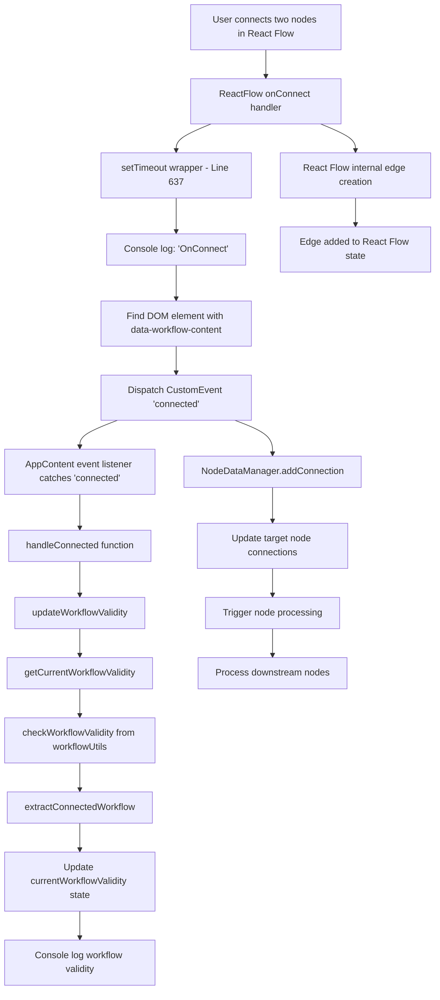
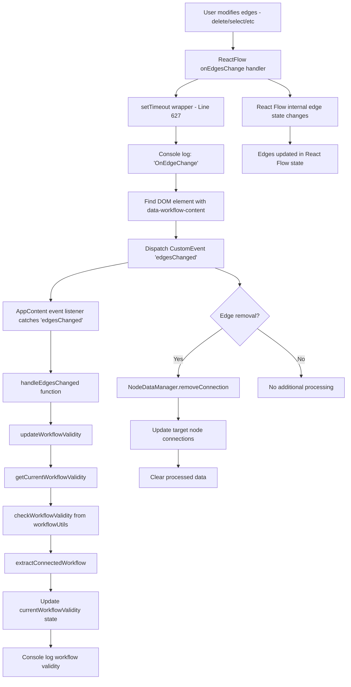

# Event Flow Analysis: onEdgesChange and onConnect

## Overview

This document provides a comprehensive trace of how `onEdgesChange` and `onConnect` events are emitted and handled in the JobRunner Workflow React Flow application.

## Architecture Overview

The application uses a multi-layered event handling system:

1. **React Flow Layer** - Native React Flow events
2. **Custom Event Layer** - DOM CustomEvents for inter-component communication
3. **Context Layer** - WorkflowContext for state management
4. **Node Data Manager** - Centralized node and connection management
5. **Validation Layer** - Workflow validation and statistics

## Event Flow Diagrams

### onConnect Event Flow



### onEdgesChange Event Flow



## Detailed Event Handling Chain

### 1. React Flow Event Emission

**Location**: `src/App.jsx` lines 625-645

```javascript
// onEdgesChange handler
onEdgesChange={(changes) => {
  // Let React Flow handle the changes first, then trigger our handlers
  setTimeout(() => {
    console.log("OnEdgeChange")
    const appContent = document.querySelector('[data-workflow-content]');
    if (appContent) {
      appContent.dispatchEvent(new CustomEvent('edgesChanged', { detail: changes }));
    }
  }, 0);
}}

// onConnect handler
onConnect={(connection) => {
  // Let React Flow handle the connection first, then trigger our handlers
  setTimeout(() => {
    console.log("OnConnect")
    const appContent = document.querySelector('[data-workflow-content]');
    if (appContent) {
      console.log("OnConnect dispatching Event")
      appContent.dispatchEvent(new CustomEvent('connected', { detail: connection }));
    }
  }, 0);
}}
```

**Key Points**:

- Uses `setTimeout(0)` to ensure React Flow processes changes first
- Dispatches custom DOM events to communicate with AppContent component
- Passes original event details through CustomEvent detail property

### 2. Custom Event Listeners

**Location**: `src/App.jsx` lines 532-549 (AppContent component)

```javascript
useEffect(() => {
  const handleNodesChanged = () => updateWorkflowValidity();
  const handleEdgesChanged = () => updateWorkflowValidity();
  const handleConnected = () => updateWorkflowValidity();

  const element = document.querySelector("[data-workflow-content]");
  if (element) {
    element.addEventListener("nodesChanged", handleNodesChanged);
    element.addEventListener("edgesChanged", handleEdgesChanged);
    element.addEventListener("connected", handleConnected);

    return () => {
      element.removeEventListener("nodesChanged", handleNodesChanged);
      element.removeEventListener("edgesChanged", handleEdgesChanged);
      element.removeEventListener("connected", handleConnected);
    };
  }
}, [updateWorkflowValidity]);
```

**Key Points**:

- All three event types trigger the same `updateWorkflowValidity` function
- Uses DOM event listeners for loose coupling between components
- Proper cleanup in useEffect return function

### 3. Workflow Validity Update

**Location**: `src/App.jsx` lines 374-381

```javascript
const updateWorkflowValidity = useCallback(() => {
  const validity = getCurrentWorkflowValidity();
  setCurrentWorkflowValidity(validity);

  // Minimal debug logging
  console.log(
    "FAB Update - Workflow Valid:",
    validity.hasWorkflow,
    `(${validity.nodeCount || 0} connected nodes, ${
      validity.edgeCount || 0
    } edges)`
  );
}, [getCurrentWorkflowValidity]);
```

### 4. Workflow Context Integration

**Location**: `src/contexts/WorkflowContext.jsx` lines 80-86

```javascript
const getCurrentWorkflowValidity = useCallback(() => {
  const nodes = getNodes();
  const edges = getEdges();
  const validity = checkWorkflowValidity(nodes, edges);

  return validity;
}, [getNodes, getEdges]);
```

### 5. Validation Logic

**Location**: `src/utils/workflowUtils.js` lines 226-263

```javascript
export function checkWorkflowValidity(nodes, edges) {
  if (!nodes || nodes.length === 0) {
    return {
      hasWorkflow: false,
      reason: "No nodes found on canvas",
      nodeCount: 0,
      edgeCount: 0,
    };
  }

  if (!edges || edges.length === 0) {
    return {
      hasWorkflow: false,
      reason: "No connections found - workflow must have connected nodes",
      nodeCount: nodes.length,
      edgeCount: 0,
    };
  }

  const { nodes: connectedNodes, edges: connectedEdges } =
    extractConnectedWorkflow(nodes, edges);

  if (connectedNodes.length === 0) {
    return {
      hasWorkflow: false,
      reason: "No connected nodes found",
      nodeCount: nodes.length,
      edgeCount: edges.length,
    };
  }

  return {
    hasWorkflow: true,
    nodeCount: connectedNodes.length,
    edgeCount: connectedEdges.length,
    totalNodes: nodes.length,
    totalEdges: edges.length,
  };
}
```

## Node Data Manager Integration

The application also includes a sophisticated Node Data Manager that handles connections at a lower level:

### Connection Addition (onConnect)

**Location**: `src/services/nodeDataManager.js` lines 191-228

```javascript
async addConnection(sourceNodeId, targetNodeId, sourceHandle = 'default', targetHandle = 'default', edgeId) {
  const connectionId = `${sourceNodeId}-${targetNodeId}-${sourceHandle}-${targetHandle}`;

  // Store connection info
  this.connections.set(connectionId, {
    id: connectionId,
    edgeId,
    sourceNodeId,
    targetNodeId,
    sourceHandle,
    targetHandle,
    createdAt: new Date().toISOString()
  });

  // Update target node's input connections
  const targetData = this.nodes.get(targetNodeId);
  if (targetData) {
    const connectionData = ConnectionData.create(sourceNodeId, sourceHandle, targetHandle);

    await this.updateNodeData(targetNodeId, {
      input: {
        connections: {
          [connectionId]: connectionData
        }
      }
    });
  }

  // Emit connection event
  this.dispatchEvent(new CustomEvent(NodeDataEvents.CONNECTION_ADDED, {
    detail: { connectionId, sourceNodeId, targetNodeId, sourceHandle, targetHandle }
  }));

  // Trigger processing of target node
  await this.processNode(targetNodeId);
}
```

### Connection Removal (onEdgesChange with removal)

**Location**: `src/services/nodeDataManager.js` lines 237-263

```javascript
async removeConnection(sourceNodeId, targetNodeId, sourceHandle = 'default', targetHandle = 'default') {
  const connectionId = `${sourceNodeId}-${targetNodeId}-${sourceHandle}-${targetHandle}`;

  // Remove connection
  this.connections.delete(connectionId);

  // Update target node's input connections
  const targetData = this.nodes.get(targetNodeId);
  if (targetData) {
    const updatedConnections = { ...targetData.input.connections };
    delete updatedConnections[connectionId];

    await this.updateNodeData(targetNodeId, {
      input: {
        connections: updatedConnections,
        processed: {} // Clear processed data when connection is removed
      }
    });
  }

  // Emit connection removed event
  this.dispatchEvent(new CustomEvent(NodeDataEvents.CONNECTION_REMOVED, {
    detail: { connectionId, sourceNodeId, targetNodeId, sourceHandle, targetHandle }
  }));
}
```

## Event Propagation Summary

### onConnect Event Chain:

1. **User Action**: User drags to connect two nodes
2. **React Flow**: Triggers `onConnect` with connection object
3. **App.jsx**: Logs "OnConnect", dispatches 'connected' CustomEvent
4. **AppContent**: Catches 'connected' event, calls `updateWorkflowValidity`
5. **WorkflowContext**: Gets current nodes/edges, validates workflow
6. **WorkflowUtils**: Extracts connected nodes, determines validity
7. **State Update**: Updates `currentWorkflowValidity` state
8. **UI Update**: WorkflowFAB and other components react to validity changes
9. **NodeDataManager**: (If integrated) Processes connection, triggers node processing

### onEdgesChange Event Chain:

1. **User Action**: User deletes, selects, or modifies edges
2. **React Flow**: Triggers `onEdgesChange` with changes array
3. **App.jsx**: Logs "OnEdgeChange", dispatches 'edgesChanged' CustomEvent
4. **AppContent**: Catches 'edgesChanged' event, calls `updateWorkflowValidity`
5. **WorkflowContext**: Gets current nodes/edges, validates workflow
6. **WorkflowUtils**: Extracts connected nodes, determines validity
7. **State Update**: Updates `currentWorkflowValidity` state
8. **UI Update**: WorkflowFAB and other components react to validity changes
9. **NodeDataManager**: (If edge removed) Cleans up connection data

## Key Design Patterns

### 1. Event Decoupling

- Uses DOM CustomEvents to decouple React Flow events from application logic
- Allows multiple components to listen to the same events independently

### 2. Asynchronous Processing

- `setTimeout(0)` ensures React Flow processes changes before custom handlers
- Prevents race conditions between React Flow state and application state

### 3. Centralized Validation

- Single source of truth for workflow validity in `workflowUtils.js`
- Consistent validation logic across the application

### 4. State Synchronization

- Multiple layers of state management (React Flow, WorkflowContext, NodeDataManager)
- Events ensure all layers stay synchronized

### 5. Reactive UI Updates

- Workflow validity changes trigger UI updates (FAB button states, etc.)
- Real-time feedback to users about workflow status

## Performance Considerations

### Current Implementation:

- Events trigger full workflow validation on every change
- Multiple event listeners for the same underlying changes
- DOM event system adds overhead

### Potential Optimizations:

- Debounce validation calls for rapid changes
- Cache validation results when nodes/edges haven't changed
- Use React context instead of DOM events for better performance
- Implement incremental validation for large workflows

## Error Handling

The system includes comprehensive error handling:

- Node processing errors are captured and stored in node state
- Connection failures are logged and don't crash the application
- Validation errors provide detailed feedback about workflow issues

## Conclusion

The event handling system in this React Flow application is sophisticated and well-architected, providing:

- Clean separation of concerns
- Robust error handling
- Real-time workflow validation
- Flexible event-driven architecture

The use of custom DOM events provides good decoupling, though there may be opportunities for performance optimization in high-frequency scenarios.
