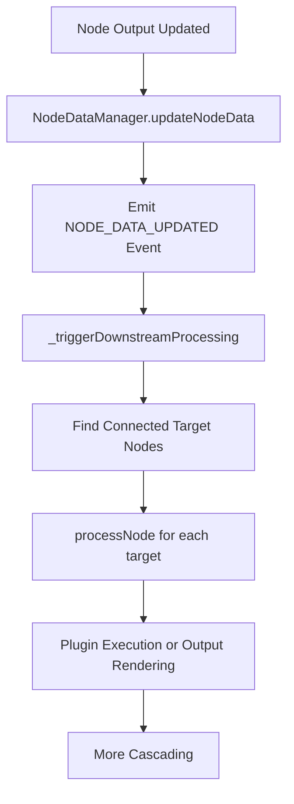
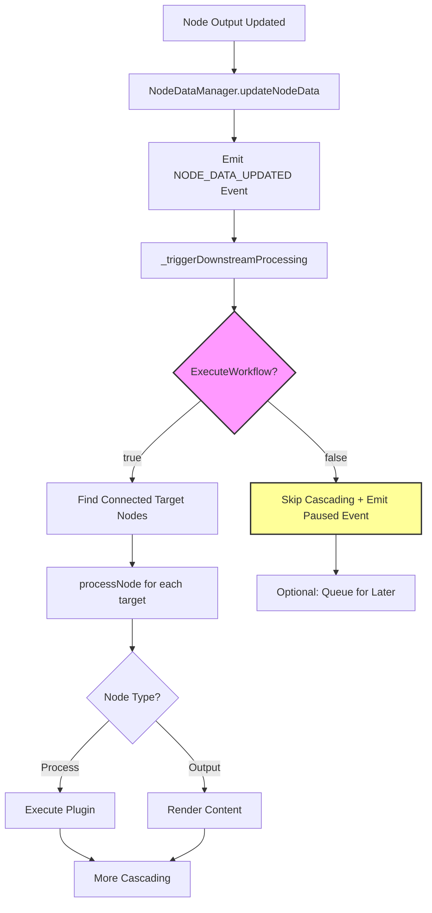

# Implementation Plan: Cascaded Workflow Execution Control

## Executive Summary

The system already has sophisticated cascading update mechanisms via the [`NodeDataManager`](src/services/nodeDataManager.js) and [`ExecuteWorkflow`](src/contexts/GlobalContext.jsx:17) boolean in [`GlobalContext`](src/contexts/GlobalContext.jsx). The goal is to integrate these elegantly without breaking existing functionality.

## Current State Analysis

### ✅ Existing Infrastructure

- **GlobalContext**: [`ExecuteWorkflow`](src/contexts/GlobalContext.jsx:17) boolean with [`toggleExecuteWorkflow()`](src/contexts/GlobalContext.jsx:19)
- **WorkflowFAB**: Play/Pause toggle button at [`line 97-113`](src/components/WorkflowFAB.jsx:97-113)
- **NodeDataManager**: Complete cascading system via [`_triggerDownstreamProcessing()`](src/services/nodeDataManager.js:632)
- **Event System**: [`NodeDataEvents`](src/services/nodeDataManager.js:14-21) for NODE_DATA_UPDATED, CONNECTION_ADDED, etc.

### 🔍 Current Flow



## Implementation Options

### **Option 1: Dependency Injection Approach** _(RECOMMENDED)_

**Rationale**: Most elegant, non-breaking, follows existing architecture patterns

**Core Changes**:

1. **Enhance NodeDataManager Constructor**

```javascript
// In src/services/nodeDataManager.js:27
constructor() {
  super();
  this.nodes = new Map();
  this.connections = new Map();
  this.processingQueue = new Map();
  this.updateCallbacks = new Map();
  this.reactFlowCallbacks = null;
  this.flowStateContext = null;
  this.globalContext = null; // NEW: Global context for ExecuteWorkflow
  this.initialized = false;
}
```

2. **Add Global Context Integration**

```javascript
// New method in NodeDataManager
setGlobalContext(globalContext) {
  this.globalContext = globalContext;
  console.log('Global context registered with NodeDataManager');
}
```

3. **Modify \_triggerDownstreamProcessing (Line 632)**

```javascript
async _triggerDownstreamProcessing(nodeId) {
  // NON-BREAKING: Default to true if not configured
  const executeWorkflow = this.globalContext?.executeWorkflow ?? true;

  if (!executeWorkflow) {
    console.log(`⏸️ Workflow execution paused - skipping downstream processing for ${nodeId}`);

    // Optional: Mark nodes as "queued for execution"
    this._markNodesAsQueued(nodeId);
    return;
  }

  // UNCHANGED: Existing downstream processing logic
  const downstreamNodes = [];
  for (const [connectionId, connection] of this.connections) {
    if (connection.sourceNodeId === nodeId) {
      downstreamNodes.push(connection.targetNodeId);
    }
  }

  const processingPromises = downstreamNodes.map(targetNodeId =>
    this.processNode(targetNodeId)
  );

  await Promise.all(processingPromises);
}
```

**Pros**:

- ✅ Zero breaking changes
- ✅ Clean separation of concerns
- ✅ Easy to test and debug
- ✅ Follows dependency injection pattern
- ✅ Minimal performance overhead

### **Option 2: Event-Driven Approach**

**How it works**: Subscribe to execution state changes via events

**Changes**:

```javascript
// Enhanced GlobalContext
const toggleExecuteWorkflow = () => {
  setExecuteWorkflow(prev => {
    const newValue = !prev;
    // Emit global event
    window.dispatchEvent(new CustomEvent('workflowExecutionToggled', {
      detail: { executeWorkflow: newValue }
    }));
    return newValue;
  });
};

// NodeDataManager listens to events
constructor() {
  // ... existing code
  this.executeWorkflow = true; // Default

  // Listen to execution state changes
  window.addEventListener('workflowExecutionToggled', (event) => {
    this.executeWorkflow = event.detail.executeWorkflow;
  });
}
```

**Pros**: More flexible, allows complex workflow states
**Cons**: More complex, requires event cleanup

### **Option 3: Context Chain Integration**

**How it works**: Integrate via existing [`FlowStateContext`](src/contexts/FlowStateContext.jsx) chain

**Pros**: Uses existing patterns
**Cons**: Tightly couples contexts

## Recommended Implementation Plan

### **Phase 1: Core Integration** (Non-Breaking)

#### Step 1: Enhance NodeDataManager

```javascript
// Add to src/services/nodeDataManager.js

setGlobalContext(globalContext) {
  this.globalContext = globalContext;
  console.log('✅ Global context registered with NodeDataManager');
}

async _triggerDownstreamProcessing(nodeId) {
  const executeWorkflow = this.globalContext?.executeWorkflow ?? true;

  if (!executeWorkflow) {
    console.log(`⏸️ Workflow paused - skipping cascading from node ${nodeId}`);
    this._emitWorkflowPausedEvent(nodeId);
    return;
  }

  console.log(`▶️ Executing downstream processing for ${nodeId}`);
  // ... existing cascading logic unchanged
}

_emitWorkflowPausedEvent(nodeId) {
  this.dispatchEvent(new CustomEvent('WORKFLOW_EXECUTION_PAUSED', {
    detail: { nodeId, timestamp: new Date().toISOString() }
  }));
}
```

#### Step 2: Wire Up in App.jsx

```javascript
// Add to src/App.jsx where NodeDataManager is initialized
const { executeWorkflow } = useGlobal();

useEffect(() => {
  nodeDataManager.setGlobalContext({ executeWorkflow });
}, [executeWorkflow]);
```

#### Step 3: Enhanced WorkflowFAB (Optional)

The WorkflowFAB already has the Play/Pause button! Just add execution count display:

```javascript
// In WorkflowFAB.jsx - add execution status indicator
{
  hasWorkflow && !isExpanded && (
    <div className="absolute -top-1 -right-1 flex gap-1">
      <div
        className={`w-4 h-4 rounded-full border-2 border-white ${
          executeWorkflow ? "bg-green-400 animate-pulse" : "bg-orange-400"
        }`}
      ></div>
      {/* Optional: Show queued processing count */}
      {queuedProcessingCount > 0 && (
        <div className="bg-blue-500 text-white text-xs rounded-full w-5 h-5 flex items-center justify-center">
          {queuedProcessingCount}
        </div>
      )}
    </div>
  );
}
```

### **Phase 2: Advanced Features** (Optional)

1. **Queued Execution**: Store nodes that would process when ExecuteWorkflow=false
2. **Batch Resume**: When ExecuteWorkflow becomes true, process queued nodes
3. **Visual Indicators**: Show "paused" status on nodes
4. **Execution Analytics**: Track how often workflow is paused/resumed

## Testing Strategy

### Unit Tests

```javascript
describe("NodeDataManager ExecuteWorkflow Integration", () => {
  test("should skip downstream processing when ExecuteWorkflow=false", async () => {
    const manager = new NodeDataManager();
    manager.setGlobalContext({ executeWorkflow: false });

    const spy = jest.spyOn(manager, "processNode");
    await manager._triggerDownstreamProcessing("node1");

    expect(spy).not.toHaveBeenCalled();
  });

  test("should continue normal processing when ExecuteWorkflow=true", async () => {
    // ... test existing behavior unchanged
  });
});
```

### Integration Tests

- Test WorkflowFAB toggle affects cascading
- Test that existing workflows continue working
- Test resume functionality after pause

## Migration Strategy

### Day 1: Core Integration

- Add `setGlobalContext()` to NodeDataManager
- Modify `_triggerDownstreamProcessing()` with ExecuteWorkflow check
- Wire up in App.jsx

### Day 2: Testing & Polish

- Add unit tests
- Test existing workflows still work
- Add visual indicators

### Day 3: Advanced Features (Optional)

- Queued execution capability
- Analytics and monitoring

## Risk Mitigation

✅ **Non-Breaking**: Default `executeWorkflow ?? true` ensures existing behavior  
✅ **Backward Compatible**: Works without GlobalContext integration  
✅ **Performance**: Minimal overhead when ExecuteWorkflow=true  
✅ **Testable**: Clear integration points for testing

## Enhanced Flow Diagram



This approach provides an elegant, non-breaking solution that leverages existing infrastructure while adding powerful workflow execution control.
