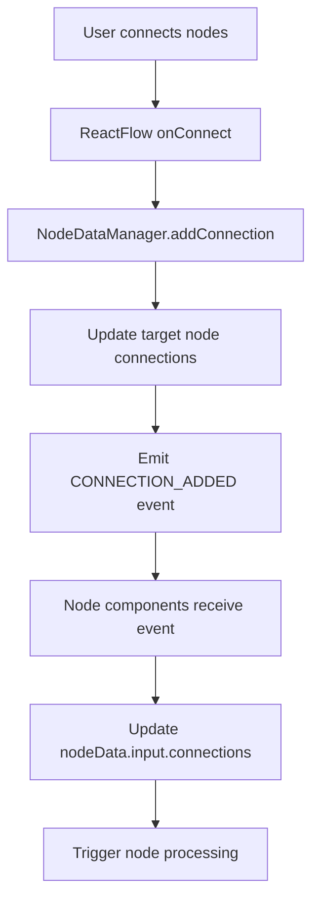
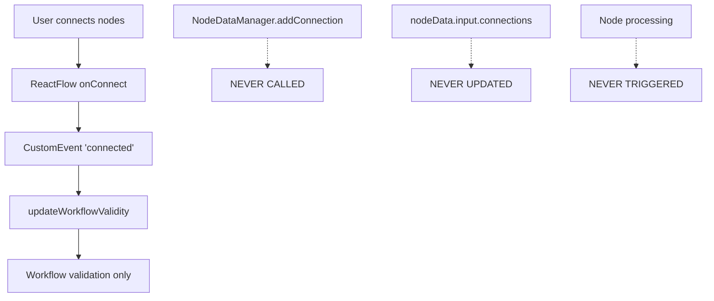

# Missing NodeDataManager Connection Analysis

## The Critical Gap

You are absolutely correct! After thorough analysis, I've discovered that **the NodeDataManager is NOT actually being triggered by the React Flow `onConnect` and `onEdgesChange` events** in the current implementation.

## What's Actually Happening

### Current Event Flow (Incomplete)

```
User connects nodes → ReactFlow onConnect → CustomEvent 'connected' →
AppContent listener → updateWorkflowValidity → WorkflowContext validation
```

### What's MISSING

```
❌ NO CONNECTION TO: NodeDataManager.addConnection()
❌ NO CONNECTION TO: NodeDataManager.removeConnection()
❌ NO UPDATE TO: nodeData.input.connections
```

## The Evidence

### 1. App.jsx React Flow Handlers

**Lines 615-645 in App.jsx:**

```javascript
onConnect={(connection) => {
  setTimeout(() => {
    console.log("OnConnect")
    const appContent = document.querySelector('[data-workflow-content]');
    if (appContent) {
      console.log("OnConnect dispatching Event")
      appContent.dispatchEvent(new CustomEvent('connected', { detail: connection }));
    }
  }, 0);
}}
```

**This ONLY dispatches a CustomEvent - it does NOT call NodeDataManager methods!**

### 2. AppContent Event Listeners

**Lines 532-549 in App.jsx:**

```javascript
const handleConnected = () => updateWorkflowValidity();

element.addEventListener("connected", handleConnected);
```

**This ONLY triggers workflow validation - no NodeDataManager integration!**

### 3. ReactFlowIntegration Helper Functions (UNUSED)

**Lines 603-697 in nodeDataManager.js:**

```javascript
export const ReactFlowIntegration = {
  handleConnect: (connection, setEdges) => {
    // This function EXISTS but is NEVER CALLED!
    nodeDataManager.addConnection(
      connection.source,
      connection.target,
      connection.sourceHandle,
      connection.targetHandle,
      edgeId
    );
  },
};
```

**These helper functions are defined but completely unused in the application!**

## How Individual Nodes Get Connection Data

### The Real Connection Mechanism

Individual node components (like `templateFormNode.jsx` and `FormNodeNew.jsx`) listen directly to NodeDataManager events:

```javascript
// From templateFormNode.jsx lines 119-121
nodeDataManager.addEventListener(
  NodeDataEvents.NODE_DATA_UPDATED,
  handleNodeDataUpdate
);
nodeDataManager.addEventListener(
  NodeDataEvents.CONNECTION_ADDED,
  handleConnectionAdded
);
nodeDataManager.addEventListener(
  NodeDataEvents.CONNECTION_REMOVED,
  handleConnectionRemoved
);
```

### But These Events Are Never Fired!

Since `NodeDataManager.addConnection()` is never called from the React Flow events, these listeners never receive connection events.

## The Broken Chain

### What Should Happen:



### What Actually Happens:



## How Nodes Currently Get Connected Data

Looking at the existing node components, they use a **different mechanism** entirely:

### Old Pattern (Still in use)

```javascript
// From Process.jsx lines 31-42
const connectedFormData = useCallback(() => {
  const nodes = getNodes(); // Direct React Flow access
  const connectedNodeIds = edges
    .filter((edge) => edge.target === currentNodeId)
    .map((edge) => edge.source);

  const formData = connectedNodeIds.map((nodeId) => {
    const node = nodes.find((n) => n.id === nodeId);
    return node?.data?.formData || node?.data?.output?.data;
  });

  return formData;
}, [getNodes, edges, currentNodeId]);
```

**This bypasses NodeDataManager entirely and reads directly from React Flow state!**

## The Fix Required

To properly integrate NodeDataManager with React Flow events, you need to:

### 1. Modify App.jsx onConnect Handler

```javascript
onConnect={(connection) => {
  // Let React Flow handle the connection first
  setTimeout(async () => {
    console.log("OnConnect")

    // Dispatch CustomEvent for workflow validation
    const appContent = document.querySelector('[data-workflow-content]');
    if (appContent) {
      appContent.dispatchEvent(new CustomEvent('connected', { detail: connection }));
    }

    // MISSING: Call NodeDataManager
    const edgeId = `${connection.source}-${connection.target}`;
    await nodeDataManager.addConnection(
      connection.source,
      connection.target,
      connection.sourceHandle || 'default',
      connection.targetHandle || 'default',
      edgeId
    );
  }, 0);
}}
```

### 2. Modify App.jsx onEdgesChange Handler

```javascript
onEdgesChange={(changes) => {
  setTimeout(async () => {
    console.log("OnEdgeChange")

    // Handle edge removals
    for (const change of changes) {
      if (change.type === 'remove') {
        const edge = getEdges().find(e => e.id === change.id);
        if (edge) {
          await nodeDataManager.removeConnection(
            edge.source,
            edge.target,
            edge.sourceHandle || 'default',
            edge.targetHandle || 'default'
          );
        }
      }
    }

    // Dispatch CustomEvent for workflow validation
    const appContent = document.querySelector('[data-workflow-content]');
    if (appContent) {
      appContent.dispatchEvent(new CustomEvent('edgesChanged', { detail: changes }));
    }
  }, 0);
}}
```

### 3. Import NodeDataManager in App.jsx

```javascript
import nodeDataManager from "./services/nodeDataManager.js";
```

## Current State Summary

### What Works:

- ✅ React Flow visual connections
- ✅ Workflow validation and UI updates
- ✅ Node components can read connected data via direct React Flow access

### What's Broken:

- ❌ NodeDataManager connection tracking
- ❌ `nodeData.input.connections` updates
- ❌ Event-driven node processing
- ❌ Proper separation of concerns
- ❌ The new schema system integration

## Impact

This missing connection means:

1. **The new schema system isn't fully utilized** - nodes fall back to old data access patterns
2. **Event-driven processing doesn't work** - nodes don't automatically process when connections change
3. **Connection metadata isn't tracked** - no timestamps, data types, etc.
4. **Plugin system integration is incomplete** - plugins can't properly aggregate inputs

The application works because nodes use the old direct React Flow access pattern, but the sophisticated NodeDataManager and new schema system are essentially bypassed for connection handling.
