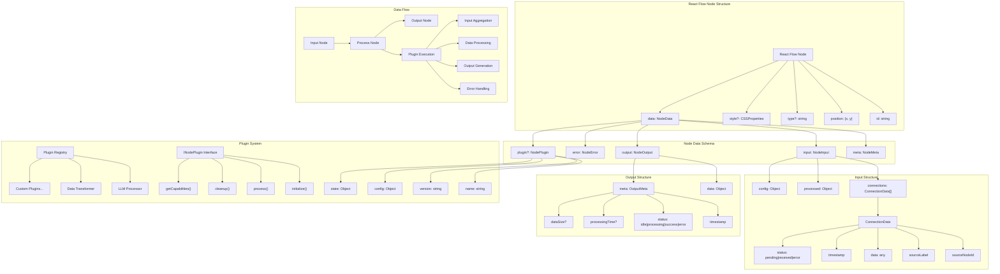
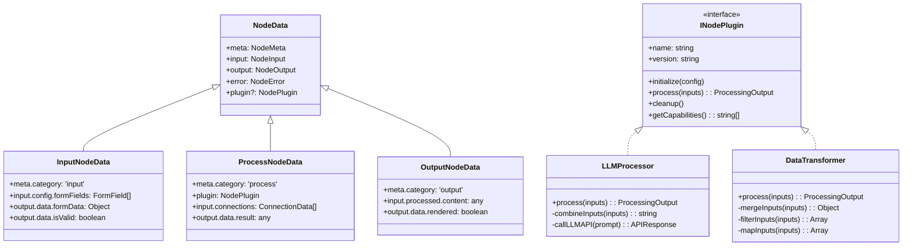
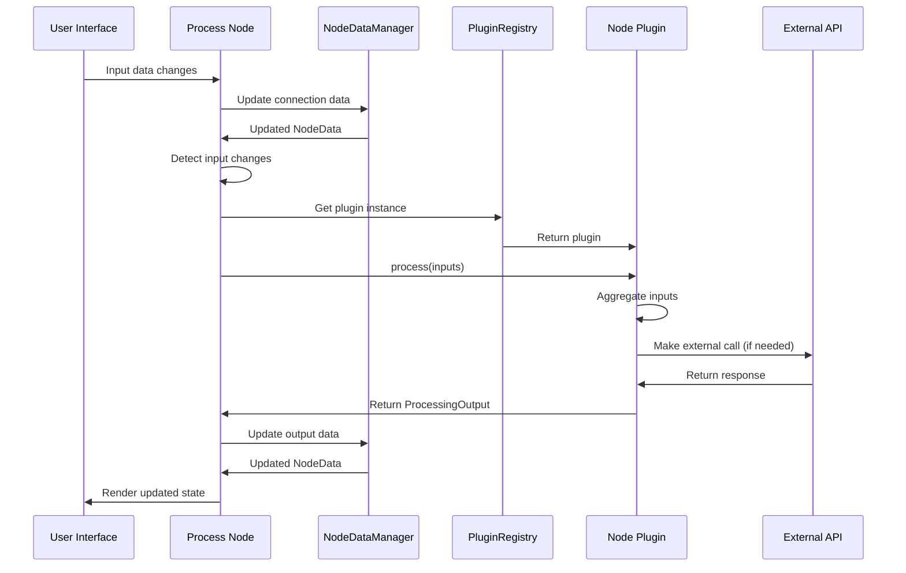
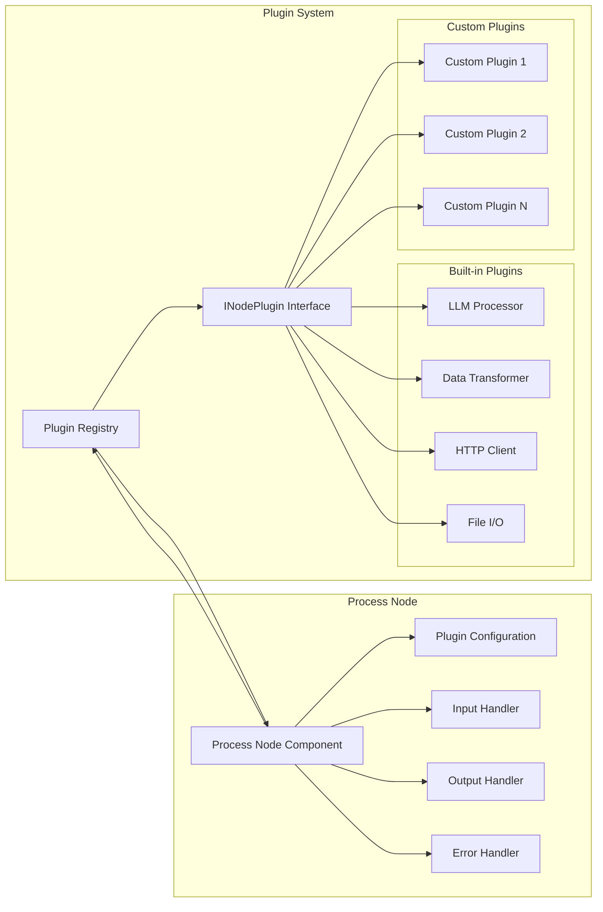
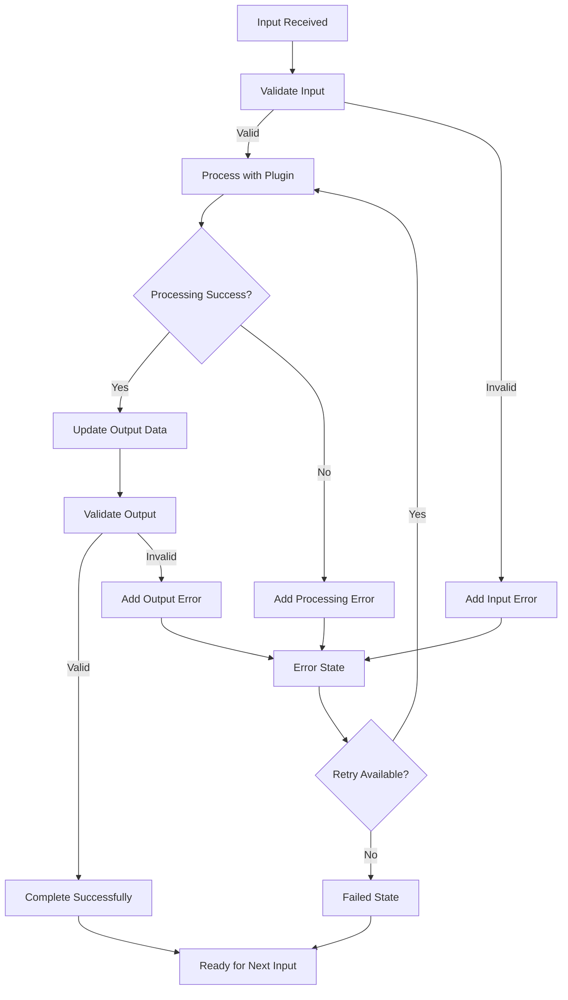
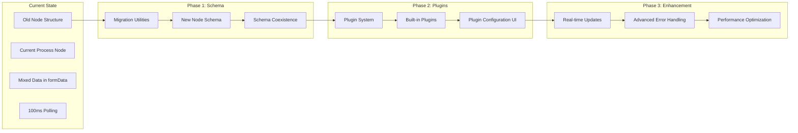
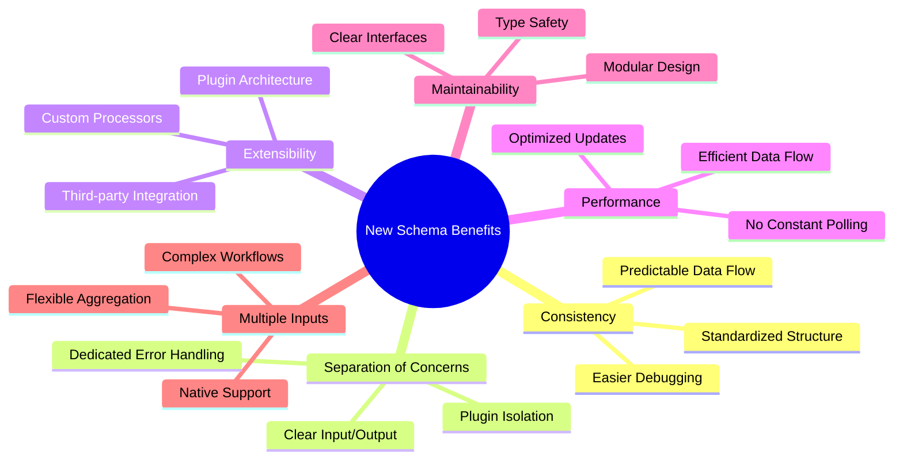

# Node Data Schema Architecture

## System Overview Diagram

## Node Type Hierarchy

## Data Flow Architecture

## Plugin Architecture

## Error Handling Flow

## Migration Path

## Key Benefits Visualization

This architecture provides a comprehensive foundation for building robust, scalable workflow nodes with clear separation of concerns, extensible plugin system, and efficient data flow management.
