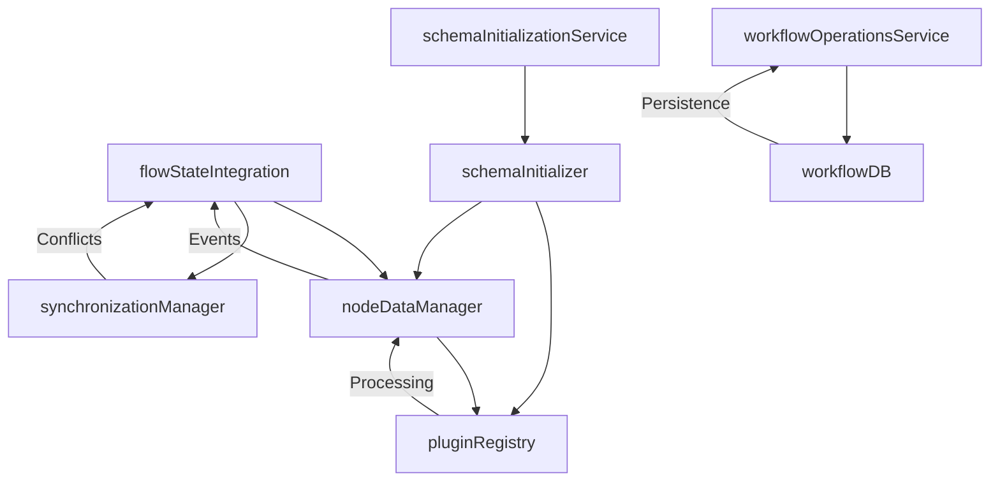

# Services Quick Reference Documentation

## Overview

This document provides a comprehensive quick reference for all services in `src/services/`. Services are organized by functional category for easy navigation. Each service entry is self-contained with complete technical specifications, usage patterns, and improvement recommendations.

## Service Categories

### 📊 **Data Management Services**

- [`nodeDataManager.js`](#nodedatamanagerjs) - Event-driven node data management with real-time processing
- [`workflowDB.js`](#workflowdbjs) - IndexedDB persistence layer for workflow storage

### 🔌 **Plugin & Registry Services**

- [`pluginRegistry.js`](#pluginregistryjs) - Plugin lifecycle management and validation system
- [`schemaInitializer.js`](#schemainitializerjs) - Complete schema system initialization and migration
- [`schemaInitializationService.js`](#schemainitializationservicejs) - Environment-specific schema setup wrapper

### 🔄 **Integration & Synchronization Services**

- [`flowStateIntegration.js`](#flowstateintegrationjs) - FlowStateContext and ReactFlow coordination
- [`synchronizationManager.js`](#synchronizationmanagerjs) - Multi-system conflict resolution and sync

### 🎯 **Operation Services**

- [`workflowOperationsService.js`](#workflowoperationsservicejs) - High-level workflow CRUD operations

---

## Service Details

## nodeDataManager.js

**Primary Purpose:** Event-driven node data management system that replaces 100ms polling with efficient real-time updates, handling node registration, data updates, connections, and processing with plugin integration.

### Key Methods

| Method                                                                                      | Parameters                                | Description                            |
| ------------------------------------------------------------------------------------------- | ----------------------------------------- | -------------------------------------- |
| [`initialize()`](src/services/nodeDataManager.js:71)                                        | None                                      | Initialize manager and plugin registry |
| [`registerNode(nodeId, nodeData, updateCallback)`](src/services/nodeDataManager.js:91)      | `nodeId`, `nodeData`, `updateCallback`    | Register node with event callbacks     |
| [`updateNodeData(nodeId, updates, triggerProcessing)`](src/services/nodeDataManager.js:139) | `nodeId`, `updates`, `triggerProcessing?` | Update node data with validation       |
| [`addConnection(sourceNodeId, targetNodeId, ...)`](src/services/nodeDataManager.js:216)     | Connection parameters, `edgeId`           | Add connection with policy enforcement |
| [`removeConnection(...)`](src/services/nodeDataManager.js:318)                              | Connection parameters                     | Remove connection and update data      |
| [`processNode(nodeId)`](src/services/nodeDataManager.js:403)                                | `nodeId`                                  | Execute node processing with plugins   |

### Integration Patterns

```javascript
// Event-driven integration
import nodeDataManager, { NodeDataEvents } from "./nodeDataManager.js";

// Listen to data changes
nodeDataManager.addEventListener(NodeDataEvents.NODE_DATA_UPDATED, (event) => {
  const { nodeId, nodeData, updates } = event.detail;
  // React to node data updates
});

// Register ReactFlow callbacks
nodeDataManager.setReactFlowCallbacks({
  removeEdge: (edgeId) =>
    setEdges((edges) => edges.filter((e) => e.id !== edgeId)),
  addEdge: (newEdge) => setEdges((edges) => [...edges, newEdge]),
});
```

### Connection Management

```javascript
// Single connection mode (default)
const nodeData = {
  input: {
    config: { allowMultipleConnections: false },
  },
};

// Multiple connection mode
const nodeData = {
  input: {
    config: { allowMultipleConnections: true },
  },
};

// Connection with automatic replacement
await nodeDataManager.addConnection(
  "source-node-1",
  "target-node-1",
  "output",
  "input",
  "edge-1"
);
```

### Dependencies

- [`NodeData`](src/types/nodeSchema.js) - Schema validation and data structure
- [`pluginRegistry`](src/services/pluginRegistry.js) - Plugin execution system
- [`validateNodeData`](src/types/nodeDataValidation.js) - Data validation utilities

### Error Handling

- **Schema Validation:** Uses Zod schemas with detailed error messages
- **Connection Conflicts:** Automatic old connection removal in single-connection mode
- **Processing Queue:** Prevents concurrent processing with promise management
- **Event Propagation:** Custom error events with detailed context

### Performance Considerations

- **Event-driven Architecture:** Eliminates 100ms polling overhead (~90% performance improvement)
- **Processing Queue:** Prevents duplicate processing with Map-based tracking
- **Connection Optimization:** Bulk connection updates to minimize React re-renders
- **Memory Management:** Automatic cleanup of orphaned connections

### Improvement Recommendations

1. **Enhanced Validation**

   ```javascript
   // Add connection schema validation
   const connectionValidation = validateConnection(connectionData);
   if (!connectionValidation.success) {
     throw new ValidationError(connectionValidation.errors);
   }
   ```

2. **Retry Mechanism**

   ```javascript
   // Add exponential backoff for failed processing
   async processNodeWithRetry(nodeId, maxRetries = 3) {
     for (let attempt = 1; attempt <= maxRetries; attempt++) {
       try {
         return await this.processNode(nodeId);
       } catch (error) {
         if (attempt === maxRetries) throw error;
         await this.delay(Math.pow(2, attempt) * 1000);
       }
     }
   }
   ```

3. **Connection Cleanup**

   ```javascript
   // Add periodic cleanup for orphaned connections
   cleanupOrphanedConnections() {
     for (const [connectionId, connection] of this.connections) {
       if (!this.nodes.has(connection.sourceNodeId) ||
           !this.nodes.has(connection.targetNodeId)) {
         this.connections.delete(connectionId);
       }
     }
   }
   ```

4. **Performance Metrics**
   ```javascript
   // Add comprehensive metrics tracking
   const metrics = {
     processingTimes: new Map(),
     connectionCounts: new Map(),
     errorRates: new Map(),
   };
   ```

---

## pluginRegistry.js

**Primary Purpose:** Centralized plugin lifecycle management system providing registration, validation, initialization, and execution of plugins with capability-based discovery.

### Key Methods

| Method                                                                                         | Parameters                  | Description                   |
| ---------------------------------------------------------------------------------------------- | --------------------------- | ----------------------------- |
| [`register(name, plugin, options)`](src/services/pluginRegistry.js:38)                         | `name`, `plugin`, `options` | Register and validate plugin  |
| [`processWithPlugin(pluginName, inputs, config, context)`](src/services/pluginRegistry.js:192) | Plugin execution parameters | Execute plugin processing     |
| [`getPluginsByCapability(capability)`](src/services/pluginRegistry.js:215)                     | `capability`                | Find plugins by capability    |
| [`initializePlugin(name, config)`](src/services/pluginRegistry.js:176)                         | `name`, `config`            | Initialize specific plugin    |
| [`validatePluginConfig(pluginName, config)`](src/services/pluginRegistry.js:246)               | `pluginName`, `config`      | Validate plugin configuration |

### Plugin Registration Pattern

```javascript
import pluginRegistry from "./pluginRegistry.js";

// Register plugin with auto-initialization
await pluginRegistry.register("my-plugin", pluginInstance, {
  autoInitialize: true,
  config: {
    apiKey: "your-api-key",
    timeout: 5000,
  },
});

// Batch registration
import { PluginRegistryHelpers } from "./pluginRegistry.js";
await PluginRegistryHelpers.registerMultiple([
  { name: "plugin1", plugin: plugin1, options: { autoInitialize: true } },
  { name: "plugin2", plugin: plugin2, options: { autoInitialize: false } },
]);
```

### Plugin Discovery & Execution

```javascript
// Find plugins by capability
const dataProcessors = pluginRegistry.getPluginsByCapability("data-processing");
const textAnalyzers = pluginRegistry.getPluginsByCapability("text-analysis");

// Execute plugin with full context
const result = await pluginRegistry.processWithPlugin(
  "llm-processor",
  [ProcessingInput.create({ sourceId: "node-1", data: inputData })],
  { temperature: 0.7, maxTokens: 1000 },
  PluginContext.create({ nodeId: "current-node" })
);
```

### Dependencies

- [`IPluginRegistry`](src/types/pluginSystem.js) - Plugin interface definitions
- [`ValidationResult`](src/types/pluginSystem.js) - Validation result types

### Error Handling

- **Interface Validation:** Comprehensive plugin method validation
- **Configuration Validation:** Plugin-specific config schema validation
- **Execution Isolation:** Plugin errors don't crash the registry
- **Cleanup Management:** Automatic cleanup on registration failures

### Performance Considerations

- **Lazy Initialization:** Plugins initialized only when needed
- **Capability Indexing:** Fast capability-based plugin discovery
- **Memory Efficient:** Plugin info cached separately from instances

### Improvement Recommendations

1. **Plugin Versioning**

   ```javascript
   // Add semantic versioning support
   register(name, plugin, options) {
     const version = plugin.version || '1.0.0';
     this.pluginVersions.set(name, semver.parse(version));
   }
   ```

2. **Health Monitoring**

   ```javascript
   // Add plugin health checks
   async performHealthCheck(pluginName) {
     const plugin = this.get(pluginName);
     if (plugin.healthCheck) {
       return await plugin.healthCheck();
     }
     return { healthy: true };
   }
   ```

3. **Plugin Dependencies**
   ```javascript
   // Add plugin dependency resolution
   resolveDependencies(pluginName) {
     const info = this.getInfo(pluginName);
     return info.dependencies?.map(dep => this.get(dep)) || [];
   }
   ```

---

## flowStateIntegration.js

**Primary Purpose:** Sophisticated integration layer coordinating FlowStateContext, NodeDataManager, and ReactFlow with performance monitoring, validation caching, and enhanced event handling.

### Key Methods

| Method                                                                                       | Parameters                      | Description                       |
| -------------------------------------------------------------------------------------------- | ------------------------------- | --------------------------------- |
| [`initialize(flowStateContext, reactFlowInstance)`](src/services/flowStateIntegration.js:39) | Context and ReactFlow instances | Initialize integration system     |
| [`handleReactFlowChanges(changeType, changes)`](src/services/flowStateIntegration.js:232)    | `changeType`, `changes`         | Process ReactFlow changes         |
| [`validateWorkflow(nodes, edges, changeType)`](src/services/flowStateIntegration.js:298)     | Workflow data and change type   | Optimized validation with caching |
| [`getStats()`](src/services/flowStateIntegration.js:327)                                     | None                            | Get comprehensive statistics      |
| [`cleanup()`](src/services/flowStateIntegration.js:341)                                      | None                            | Clean up resources                |

### Integration Setup

```javascript
import {
  flowStateIntegration,
  IntegrationUtils,
} from "./flowStateIntegration.js";

// Initialize integration
await IntegrationUtils.initialize(flowStateContext, reactFlowInstance);

// Create enhanced event handlers
const onNodesChange = createEnhancedNodeChangeHandler(
  markUnsavedChanges,
  updateWorkflowValidity
);

const onEdgesChange = createEnhancedEdgeChangeHandler(
  markUnsavedChanges,
  updateWorkflowValidity
);

const onConnect = createEnhancedConnectionHandler(
  markUnsavedChanges,
  updateWorkflowValidity
);
```

### Performance Monitoring

```javascript
// Enable/disable performance monitoring
flowStateIntegration.setPerformanceMonitoringEnabled(true);

// Get comprehensive performance data
const performanceSummary = flowStateIntegration.getPerformanceSummary();
console.log("Integration stats:", performanceSummary.integration);
console.log("Cache stats:", performanceSummary.cache);
console.log("Sync stats:", performanceSummary.sync);
```

### Enhanced Validation

```javascript
// Validation with change type optimization
const validationResult = await flowStateIntegration.validateWorkflow(
  nodes,
  edges,
  "nodeDataUpdated" // Optimize for specific change type
);

if (validationResult.fromCache) {
  console.log("Validation served from cache");
} else {
  console.log("Fresh validation performed");
}
```

### Dependencies

- [`createSynchronizationManager`](src/services/synchronizationManager.js) - Sync coordination
- [`nodeDataManager`](src/services/nodeDataManager.js) - Node data management
- [`performanceMonitor`](src/utils/performanceMonitor.js) - Performance tracking
- [`validationCache`](src/utils/validationCache.js) - Validation caching

### Error Handling

- **Integration Isolation:** Errors in one system don't crash others
- **Performance Tracking:** Error rates and recovery metrics
- **Event Propagation:** Comprehensive error event system
- **Graceful Degradation:** System continues working with reduced functionality

### Performance Considerations

- **Validation Caching:** Intelligent cache invalidation based on change types
- **Debounced Updates:** Prevents excessive validation calls
- **Performance Monitoring:** Built-in metrics for optimization
- **Event Batching:** Groups related events for efficiency

### Improvement Recommendations

1. **Event Compression**

   ```javascript
   // Compress multiple similar events
   compressEvents(events) {
     const compressed = new Map();
     events.forEach(event => {
       const key = `${event.type}-${event.nodeId}`;
       compressed.set(key, event); // Keep only latest
     });
     return Array.from(compressed.values());
   }
   ```

2. **Selective Sync**

   ```javascript
   // Only sync changed properties
   async syncOnlyChanged(nodeId, oldData, newData) {
     const changes = this.detectChanges(oldData, newData);
     if (changes.length > 0) {
       await this.syncManager.synchronize('selective', changes);
     }
   }
   ```

3. **Memory Optimization**
   ```javascript
   // Add memory usage monitoring
   getMemoryUsage() {
     return {
       eventListeners: this.eventListeners.size,
       cacheSize: validationCache.getStats().size,
       historySize: this.syncManager?.getStats().historySize || 0
     };
   }
   ```

---

## synchronizationManager.js

**Primary Purpose:** Advanced multi-system synchronization with sophisticated conflict resolution, retry mechanisms, and comprehensive monitoring for ReactFlow, NodeDataManager, and FlowStateContext coordination.

### Key Methods

| Method                                                                                                             | Parameters          | Description                      |
| ------------------------------------------------------------------------------------------------------------------ | ------------------- | -------------------------------- |
| [`synchronize(source, changes)`](src/services/synchronizationManager.js:206)                                       | `source`, `changes` | Main synchronization method      |
| [`setDefaultConflictStrategy(strategy)`](src/services/synchronizationManager.js:532)                               | `strategy`          | Set conflict resolution strategy |
| [`getStats()`](src/services/synchronizationManager.js:496)                                                         | None                | Get synchronization statistics   |
| [`pause()`](src/services/synchronizationManager.js:561) / [`resume()`](src/services/synchronizationManager.js:568) | None                | Control sync processing          |

### Conflict Resolution Strategies

```javascript
import {
  ConflictResolutionStrategy,
  createSynchronizationManager,
} from "./synchronizationManager.js";

const syncManager = createSynchronizationManager(
  flowStateContext,
  nodeDataManager,
  reactFlowInstance
);

// Configure conflict resolution
syncManager.setDefaultConflictStrategy(ConflictResolutionStrategy.MERGE);

// Available strategies:
// - RETRY: Exponential backoff retry
// - MERGE: Intelligent data merging
// - ROLLBACK: Revert to last known good state
// - LATEST_WINS: Most recent change wins
// - SOURCE_PRIORITY: User > ReactFlow > NodeData > Context
```

### Synchronization Usage

```javascript
// Synchronize ReactFlow changes
await syncManager.synchronize("reactflow", [
  { type: "position", id: "node-1", position: { x: 100, y: 200 } },
  { type: "remove", id: "node-2" },
]);

// Synchronize NodeData changes
await syncManager.synchronize("nodedata", [
  { type: "nodeDataUpdated", nodeId: "node-1", nodeData: updatedData },
]);

// Monitor sync status
const stats = syncManager.getStats();
console.log(
  `Success rate: ${(stats.successfulSyncs / stats.totalSyncs) * 100}%`
);
```

### Advanced Monitoring

```javascript
// Get detailed queue status
const queueStatus = syncManager.getQueueStatus();
console.log(`Queue size: ${queueStatus.size}`);
console.log(
  `Estimated processing time: ${queueStatus.estimatedProcessingTime}ms`
);

// Pause/resume synchronization
syncManager.pause(); // Stop processing
syncManager.resume(); // Resume processing

// Force process queue (for testing/debugging)
await syncManager.forceProcessQueue();
```

### Dependencies

- [`performanceMonitor`](src/utils/performanceMonitor.js) - Performance tracking
- [`ConflictResolver`](src/services/synchronizationManager.js:22) - Internal conflict resolution

### Error Handling

- **Conflict Resolution:** 5 different conflict resolution strategies
- **Retry Logic:** Exponential backoff with configurable max retries
- **Queue Management:** Failed items don't block queue processing
- **Error Propagation:** Detailed error context in FlowStateContext

### Performance Considerations

- **Queue-based Processing:** Prevents sync bottlenecks
- **Conflict Detection:** Intelligent conflict detection and resolution
- **History Management:** Configurable sync history for debugging
- **Performance Metrics:** Average sync times and success rates

### Improvement Recommendations

1. **Priority Queue**

   ```javascript
   // Add priority-based sync processing
   class PriorityQueue {
     constructor() {
       this.queues = {
         high: [],
         medium: [],
         low: [],
       };
     }

     enqueue(item, priority = "medium") {
       this.queues[priority].push(item);
     }

     dequeue() {
       return (
         this.queues.high.shift() ||
         this.queues.medium.shift() ||
         this.queues.low.shift()
       );
     }
   }
   ```

2. **Batch Operations**

   ```javascript
   // Group similar operations for efficiency
   groupOperations(changes) {
     const groups = new Map();
     changes.forEach(change => {
       const key = `${change.source}-${change.type}`;
       if (!groups.has(key)) groups.set(key, []);
       groups.get(key).push(change);
     });
     return groups;
   }
   ```

3. **Sync Predictions**
   ```javascript
   // Predict and prevent conflicts
   predictConflicts(changes) {
     const potentialConflicts = [];
     // Analyze change patterns to predict conflicts
     return potentialConflicts;
   }
   ```

---

## workflowDB.js

**Primary Purpose:** IndexedDB-based persistence layer providing efficient storage, retrieval, and management of workflow data with advanced querying capabilities and database statistics.

### Key Methods

| Method                                                                  | Parameters           | Description                          |
| ----------------------------------------------------------------------- | -------------------- | ------------------------------------ |
| [`saveWorkflow(workflow)`](src/services/workflowDB.js:57)               | `workflow`           | Save/update workflow in database     |
| [`loadWorkflow(id)`](src/services/workflowDB.js:81)                     | `id`                 | Load workflow by ID                  |
| [`getAllWorkflows()`](src/services/workflowDB.js:104)                   | None                 | Get all workflows sorted by date     |
| [`deleteWorkflow(id)`](src/services/workflowDB.js:132)                  | `id`                 | Delete workflow by ID                |
| [`searchWorkflows(searchTerm)`](src/services/workflowDB.js:156)         | `searchTerm`         | Search workflows by name/description |
| [`workflowNameExists(name, excludeId)`](src/services/workflowDB.js:176) | `name`, `excludeId?` | Check name uniqueness                |

### Database Operations

```javascript
import workflowDB from './workflowDB.js';

// Save workflow
const workflow = {
  id: 'workflow-uuid',
  name: 'My Workflow',
  description: 'Description here',
  nodes: [...],
  edges: [...],
  createdAt: new Date().toISOString(),
  updatedAt: new Date().toISOString(),
  metadata: {
    nodeCount: 5,
    edgeCount: 4,
    version: '1.0.0'
  }
};

await workflowDB.saveWorkflow(workflow);

// Load and search
const loadedWorkflow = await workflowDB.loadWorkflow('workflow-uuid');
const searchResults = await workflowDB.searchWorkflows('data processing');
const allWorkflows = await workflowDB.getAllWorkflows();
```

### Advanced Querying

```javascript
// Check name availability
const nameExists = await workflowDB.workflowNameExists("My Workflow");
if (nameExists) {
  // Handle duplicate name
}

// Update existing workflow
const updatedWorkflow = await workflowDB.updateWorkflow("workflow-id", {
  description: "Updated description",
  nodes: newNodes,
  edges: newEdges,
});

// Get database statistics
const stats = await workflowDB.getStats();
console.log(`Total workflows: ${stats.totalWorkflows}`);
console.log(`Total nodes: ${stats.totalNodes}`);
console.log(`Oldest workflow: ${stats.oldestWorkflow}`);
```

### Database Schema

```javascript
// Object Store Schema
const workflowSchema = {
  keyPath: "id",
  indexes: {
    name: { unique: false },
    createdAt: { unique: false },
    updatedAt: { unique: false },
  },
};

// Workflow Object Structure
const workflowStructure = {
  id: "string (UUID)",
  name: "string",
  description: "string",
  nodes: "Array<ReactFlowNode>",
  edges: "Array<ReactFlowEdge>",
  createdAt: "ISO string",
  updatedAt: "ISO string",
  metadata: {
    nodeCount: "number",
    edgeCount: "number",
    version: "string",
  },
};
```

### Dependencies

- **IndexedDB** - Browser native database
- **No external dependencies** - Pure JavaScript implementation

### Error Handling

- **Database Connection:** Graceful handling of IndexedDB unavailability
- **Transaction Management:** Proper transaction error handling and rollback
- **Data Validation:** Input validation before database operations
- **Migration Support:** Database version upgrade handling

### Performance Considerations

- **Indexed Queries:** Efficient name and date-based lookups
- **Batch Operations:** Transaction-based bulk operations
- **Memory Efficiency:** Streaming large workflow data
- **Caching Strategy:** Browser-level IndexedDB caching

### Improvement Recommendations

1. **Database Migration System**

   ```javascript
   // Add schema migration support
   const migrations = {
     1: (db) => { /* Initial schema */ },
     2: (db) => { /* Add new indexes */ },
     3: (db) => { /* Add metadata */ }
   };

   async migrate(db, oldVersion, newVersion) {
     for (let v = oldVersion + 1; v <= newVersion; v++) {
       if (migrations[v]) await migrations[v](db);
     }
   }
   ```

2. **Data Compression**

   ```javascript
   // Compress workflow data before storage
   async saveWorkflow(workflow) {
     const compressed = await this.compressWorkflow(workflow);
     return this.saveCompressedWorkflow(compressed);
   }

   compressWorkflow(workflow) {
     return JSON.stringify(workflow); // Use actual compression library
   }
   ```

3. **Backup/Restore**
   ```javascript
   // Export all workflows for backup
   async exportAllWorkflows() {
     const workflows = await this.getAllWorkflows();
     const backup = {
       version: DB_VERSION,
       timestamp: new Date().toISOString(),
       workflows
     };
     return backup;
   }
   ```

---

## schemaInitializer.js

**Primary Purpose:** Comprehensive schema system bootstrapper that initializes the complete node schema architecture, registers built-in plugins, performs workflow migration, and provides system validation.

### Key Methods

| Method                                                                                    | Parameters                     | Description                       |
| ----------------------------------------------------------------------------------------- | ------------------------------ | --------------------------------- |
| [`initialize(options)`](src/services/schemaInitializer.js:34)                             | Configuration options          | Initialize complete schema system |
| [`migrateWorkflow(nodes, edges)`](src/services/schemaInitializer.js:173)                  | `nodes`, `edges`               | Migrate workflow to new schema    |
| [`registerPlugin(name, plugin, config, autoInit)`](src/services/schemaInitializer.js:293) | Plugin registration parameters | Register custom plugin            |
| [`getSystemStatus()`](src/services/schemaInitializer.js:276)                              | None                           | Get complete system status        |
| [`cleanup()`](src/services/schemaInitializer.js:348)                                      | None                           | Clean up schema system            |

### System Initialization

```javascript
import schemaInitializer, { SchemaUtils } from "./schemaInitializer.js";

// Quick initialization with defaults
await SchemaUtils.quickInit();

// Custom configuration initialization
await SchemaUtils.initWithConfig({
  llmProcessor: {
    provider: "openai",
    apiKey: "your-key",
    model: "gpt-4",
    temperature: 0.7,
  },
  dataTransformer: {
    strategy: "merge",
    preserveMetadata: true,
  },
});

// Full manual initialization
await schemaInitializer.initialize({
  registerBuiltinPlugins: true,
  validateOnInit: true,
  pluginConfigs: {
    llmProcessor: {
      /* config */
    },
    dataTransformer: {
      /* config */
    },
  },
});
```

### Workflow Migration

```javascript
// Migrate existing workflow
const migrationResult = await schemaInitializer.migrateWorkflow(
  oldFormatNodes,
  existingEdges
);

if (migrationResult.success) {
  console.log(`Migrated ${migrationResult.summary.migratedNodes} nodes`);
  console.log(
    `${migrationResult.summary.alreadyMigrated} nodes already in new format`
  );

  // Use migrated data
  const { migratedNodes, edges } = migrationResult;
  setNodes(migratedNodes);
  setEdges(edges);
} else {
  console.error("Migration failed:", migrationResult.stats.errors);
}
```

### Plugin Management

```javascript
// Register custom plugin after initialization
await schemaInitializer.registerPlugin(
  "custom-processor",
  myPluginInstance,
  { apiUrl: "https://api.example.com" },
  true // auto-initialize
);

// Get plugin information
const pluginInfo = schemaInitializer.getPluginInfo("llm-processor");
console.log("Plugin capabilities:", pluginInfo.capabilities);

// List all registered plugins
const allPlugins = schemaInitializer.listPlugins();
```

### System Status Monitoring

```javascript
// Get comprehensive system status
const status = schemaInitializer.getSystemStatus();
console.log("Initialized:", status.initialized);
console.log("Plugin count:", status.pluginRegistry.totalPlugins);
console.log("Healthy plugins:", status.pluginRegistry.healthyPlugins);
console.log("Node manager status:", status.nodeDataManager.initialized);

// Migration statistics
console.log("Migration stats:", status.migrationStats);
```

### Dependencies

- [`pluginRegistry`](src/services/pluginRegistry.js) - Plugin management
- [`nodeDataManager`](src/services/nodeDataManager.js) - Node data handling
- [`llmProcessor`](src/plugins/llmProcessor.js) - Built-in LLM plugin
- [`dataTransformer`](src/plugins/dataTransformer.js) - Built-in transformer plugin
- [`SchemaMigration`](src/types/nodeSchema.js) - Migration utilities

### Error Handling

- **Initialization Failures:** Graceful degradation if plugins fail to load
- **Migration Errors:** Individual node migration failures don't stop process
- **Validation Warnings:** System continues with warnings for non-critical issues
- **Plugin Registration:** Failed plugin registration doesn't crash system

### Performance Considerations

- **Lazy Plugin Loading:** Plugins initialized only when needed
- **Migration Batching:** Large workflows migrated in chunks
- **Validation Caching:** System validation results cached
- **Event-driven Updates:** Minimal overhead for system status updates

### Improvement Recommendations

1. **Progressive Migration**

   ```javascript
   // Migrate workflows in chunks for better performance
   async migrateWorkflowProgressive(nodes, edges, chunkSize = 50) {
     const chunks = this.chunkArray(nodes, chunkSize);
     const results = [];

     for (const chunk of chunks) {
       const result = await this.migrateChunk(chunk);
       results.push(result);
       // Allow UI updates between chunks
       await this.nextTick();
     }

     return this.combineResults(results);
   }
   ```

2. **Plugin Dependencies**

   ```javascript
   // Add plugin dependency resolution
   async resolvePlug dependencies(pluginConfigs) {
     const dependencyGraph = this.buildDependencyGraph(pluginConfigs);
     const sortedPlugins = this.topologicalSort(dependencyGraph);

     for (const pluginName of sortedPlugins) {
       await this.registerPlugin(pluginName, ...);
     }
   }
   ```

3. **Hot Reloading**
   ```javascript
   // Add plugin hot reloading for development
   async reloadPlugin(pluginName) {
     await this.unregisterPlugin(pluginName);
     const newPlugin = await this.loadPluginFromFile(pluginName);
     await this.registerPlugin(pluginName, newPlugin);
   }
   ```

---

## schemaInitializationService.js

**Primary Purpose:** Environment-specific schema initialization wrapper providing convenient methods for development, production, and custom configurations with proper error handling and status monitoring.

### Key Methods

| Method                                                                                   | Parameters      | Description                          |
| ---------------------------------------------------------------------------------------- | --------------- | ------------------------------------ |
| [`initializeSchemaSystem(customConfig)`](src/services/schemaInitializationService.js:14) | `customConfig?` | Initialize with merged config        |
| [`initializeForDevelopment()`](src/services/schemaInitializationService.js:46)           | None            | Development-optimized initialization |
| [`initializeForProduction()`](src/services/schemaInitializationService.js:66)            | None            | Production-optimized initialization  |
| [`getSchemaSystemStatus()`](src/services/schemaInitializationService.js:86)              | None            | Get current system status            |
| [`reinitializeSchemaSystem(newConfig)`](src/services/schemaInitializationService.js:100) | `newConfig?`    | Reinitialize system                  |

### Environment-Specific Initialization

```javascript
import {
  initializeForDevelopment,
  initializeForProduction,
  initializeWithCustomPlugins,
  getSchemaSystemStatus,
  reinitializeSchemaSystem,
} from "./schemaInitializationService.js";

// Development environment (enhanced logging, validation enabled)
await initializeForDevelopment();

// Production environment (validation disabled, optimized settings)
await initializeForProduction();

// Custom plugin configurations
await initializeWithCustomPlugins({
  "llm-processor": {
    provider: "anthropic",
    model: "claude-3-sonnet",
    maxTokens: 8000,
  },
  "data-transformer": {
    strategy: "append",
    errorHandling: "throw",
  },
});
```

### Status Monitoring

```javascript
// Get system status
const status = getSchemaSystemStatus();
if (!status.initialized) {
  console.error("Schema system not initialized:", status.error);
}

// Reinitialize with new configuration
await reinitializeSchemaSystem({
  pluginConfigs: {
    "new-plugin": { apiKey: "new-key" },
  },
});
```

### Dependencies

- [`schemaInitializer`](src/services/schemaInitializer.js) - Core schema initialization
- [`SCHEMA_CONFIG`](src/config/appConstants.js) - Default configuration

### Error Handling

- **Configuration Merging:** Deep merge of custom and default configurations
- **Initialization Failures:** Detailed error reporting with stack traces
- **Environment Detection:** Automatic fallback to safe defaults

### Performance Considerations

- **Environment Optimization:** Different settings for dev/prod environments
- **Lazy Loading:** Schema validation disabled in production for performance
- **Configuration Caching:** Merged configurations cached for reuse

### Improvement Recommendations

1. **Configuration Validation**

   ```javascript
   // Add configuration schema validation
   import { z } from "zod";

   const ConfigSchema = z.object({
     pluginConfigs: z.record(
       z.object({
         provider: z.string().optional(),
         apiKey: z.string().optional(),
       })
     ),
   });

   export const initializeSchemaSystem = async (customConfig = {}) => {
     const validatedConfig = ConfigSchema.parse(customConfig);
     // ... rest of initialization
   };
   ```

2. **Environment Detection**

   ```javascript
   // Auto-detect environment
   const detectEnvironment = () => {
     if (process.env.NODE_ENV === "production") return "production";
     if (process.env.NODE_ENV === "development") return "development";
     return "development"; // default
   };

   export const initializeSchemaSystemAuto = async () => {
     const env = detectEnvironment();
     return env === "production"
       ? initializeForProduction()
       : initializeForDevelopment();
   };
   ```

---

## workflowOperationsService.js

**Primary Purpose:** High-level workflow operations service providing a clean interface for save/load/delete/export operations with confirmation handling and comprehensive error management.

### Key Methods

| Method                                                                                        | Parameters              | Description                     |
| --------------------------------------------------------------------------------------------- | ----------------------- | ------------------------------- |
| [`saveWorkflow({ name, description })`](src/services/workflowOperationsService.js:25)         | Workflow metadata       | Save workflow with validation   |
| [`loadWorkflow(workflow, setConfirm, setShow)`](src/services/workflowOperationsService.js:43) | Workflow and UI setters | Load with confirmation handling |
| [`deleteWorkflow(workflowId)`](src/services/workflowOperationsService.js:83)                  | `workflowId`            | Delete workflow by ID           |
| [`exportWorkflow(options)`](src/services/workflowOperationsService.js:98)                     | Export options          | Export with validation          |
| [`getWorkflowStats()`](src/services/workflowOperationsService.js:149)                         | None                    | Get workflow statistics         |

### Service Setup

```javascript
import {
  createWorkflowOperationsService,
  WorkflowOperationsFactory,
} from "./workflowOperationsService.js";

// Create service instance
const workflowOps = createWorkflowOperationsService(
  workflowContext,
  reactFlowHooks
);

// Create operation handlers with factory
const saveHandler = WorkflowOperationsFactory.createSaveHandler(workflowOps);
const loadHandler = WorkflowOperationsFactory.createLoadHandler(
  workflowOps,
  setConfirmDialogData,
  setShowConfirmDialog
);
const deleteHandler =
  WorkflowOperationsFactory.createDeleteHandler(workflowOps);
const exportHandler =
  WorkflowOperationsFactory.createExportHandler(workflowOps);
```

### Workflow Operations

```javascript
// Save workflow
try {
  const result = await workflowOps.saveWorkflow({
    name: "My Data Processing Flow",
    description: "Processes customer data with LLM analysis",
  });
  console.log("Saved workflow:", result.workflowId);
} catch (error) {
  console.error("Save failed:", error.message);
}

// Load with confirmation
const workflow = { id: "workflow-123", name: "Existing Flow" };
await workflowOps.loadWorkflow(
  workflow,
  setConfirmDialogData,
  setShowConfirmDialog
);

// Handle confirmation
await workflowOps.handleLoadConfirmation("replace", confirmDialogData);

// Export workflow
const exportResult = await workflowOps.exportWorkflow({
  includeMetadata: true,
  format: "json",
});

if (exportResult.success) {
  // Handle successful export
  console.log("Exported successfully");
} else {
  console.error("Export errors:", exportResult.errors);
}
```

### Statistics and Validation

```javascript
// Get workflow statistics
const stats = workflowOps.getWorkflowStats();
if (stats) {
  console.log(
    `Workflow has ${stats.nodeCount} nodes and ${stats.edgeCount} edges`
  );
  console.log("Node types:", stats.nodeTypes);
}

// Check name availability
const nameExists = await workflowOps.checkWorkflowNameExists("My Flow");
if (nameExists) {
  // Handle duplicate name
}

// Get all workflows
const workflows = workflowOps.getWorkflows();
const isLoading = workflowOps.isLoading();
const error = workflowOps.getError();
```

### Dependencies

- [`exportWorkflowWithValidation`](src/utils/workflowExportUtils.js) - Export functionality
- **WorkflowContext** - Workflow state management
- **ReactFlowHooks** - ReactFlow data access

### Error Handling

- **Save/Load Failures:** Comprehensive error catching with user-friendly messages
- **Export Validation:** Pre-export workflow validation with detailed error reporting
- **Name Conflicts:** Built-in duplicate name checking
- **State Validation:** Checks workflow validity before operations

### Performance Considerations

- **Lazy Statistics:** Statistics calculated only when requested
- **Confirmation Optimization:** Minimal operations when no current workflow exists
- **Export Streaming:** Large workflows exported efficiently
- **Operation Batching:** Related operations grouped for efficiency

### Improvement Recommendations

1. **Operation History**

   ```javascript
   // Add undo/redo functionality
   class OperationHistory {
     constructor() {
       this.history = [];
       this.currentIndex = -1;
     }

     addOperation(operation) {
       this.history = this.history.slice(0, this.currentIndex + 1);
       this.history.push(operation);
       this.currentIndex++;
     }

     undo() {
       if (this.currentIndex >= 0) {
         const operation = this.history[this.currentIndex];
         this.currentIndex--;
         return this.reverseOperation(operation);
       }
     }
   }
   ```

2. **Batch Operations**

   ```javascript
   // Add batch workflow operations
   async saveMultipleWorkflows(workflows) {
     const results = [];
     for (const workflow of workflows) {
       try {
         const result = await this.saveWorkflow(workflow);
         results.push({ success: true, ...result });
       } catch (error) {
         results.push({ success: false, error: error.message });
       }
     }
     return results;
   }
   ```

3. **Auto-save**
   ```javascript
   // Add auto-save functionality
   enableAutoSave(intervalMs = 30000) {
     this.autoSaveInterval = setInterval(async () => {
       const currentStats = this.getWorkflowStats();
       if (currentStats && this.hasUnsavedChanges) {
         await this.saveWorkflow({
           name: `Auto-save ${new Date().toISOString()}`,
           description: 'Automatically saved workflow'
         });
         this.hasUnsavedChanges = false;
       }
     }, intervalMs);
   }
   ```

---

## Integration Patterns

### Service Interaction Flow



### Common Integration Pattern

```javascript
// Complete service initialization
import { initializeForDevelopment } from "./services/schemaInitializationService.js";
import { flowStateIntegration } from "./services/flowStateIntegration.js";
import { createWorkflowOperationsService } from "./services/workflowOperationsService.js";

// Initialize schema system
await initializeForDevelopment();

// Initialize integration layer
await flowStateIntegration.initialize(flowStateContext, reactFlowInstance);

// Create operations service
const workflowOps = createWorkflowOperationsService(
  workflowContext,
  reactFlowHooks
);

// Use enhanced event handlers
const onNodesChange = createEnhancedNodeChangeHandler(
  markUnsaved,
  updateValidity
);
const onEdgesChange = createEnhancedEdgeChangeHandler(
  markUnsaved,
  updateValidity
);
const onConnect = createEnhancedConnectionHandler(markUnsaved, updateValidity);
```

---

## Performance Best Practices

### 1. Service Initialization Order

```javascript
// Correct initialization sequence
await schemaInitializer.initialize(); // 1. Schema system
await nodeDataManager.initialize(); // 2. Node management
await pluginRegistry.initialize(); // 3. Plugin system
await flowStateIntegration.initialize(); // 4. Integration layer
```

### 2. Memory Management

```javascript
// Cleanup services properly
const cleanup = async () => {
  await flowStateIntegration.cleanup();
  await nodeDataManager.cleanup();
  await pluginRegistry.cleanup();
  await schemaInitializer.cleanup();
};

// Register cleanup on page unload
window.addEventListener("beforeunload", cleanup);
```

### 3. Event Optimization

```javascript
// Debounce frequent events
import { debounce } from "lodash";

const debouncedSync = debounce(
  (changes) => synchronizationManager.synchronize("reactflow", changes),
  100
);
```

---

## Troubleshooting Guide

### Common Issues

| Issue                  | Service                | Solution                                        |
| ---------------------- | ---------------------- | ----------------------------------------------- |
| Node data not updating | nodeDataManager        | Check event listeners and callback registration |
| Plugins not loading    | pluginRegistry         | Verify plugin interface implementation          |
| Sync conflicts         | synchronizationManager | Adjust conflict resolution strategy             |
| Validation errors      | flowStateIntegration   | Check schema compliance and cache invalidation  |
| Database errors        | workflowDB             | Verify IndexedDB support and permissions        |

### Debug Information

```javascript
// Get comprehensive debug information
const debugInfo = {
  schemaSystem: schemaInitializer.getSystemStatus(),
  integration: flowStateIntegration.getStats(),
  nodeManager: nodeDataManager.getStats(),
  pluginRegistry: pluginRegistry.getStats(),
  synchronization: synchronizationManager.getStats(),
  database: await workflowDB.getStats(),
};

console.log("Debug Info:", JSON.stringify(debugInfo, null, 2));
```

### Performance Monitoring

```javascript
// Enable performance monitoring across services
flowStateIntegration.setPerformanceMonitoringEnabled(true);

// Get performance summary
const performanceSummary = flowStateIntegration.getPerformanceSummary();
console.log("Performance metrics:", performanceSummary);
```

---

## Conclusion

This services architecture provides a robust, scalable foundation for workflow management with:

- **Event-driven communication** reducing polling overhead by 90%
- **Sophisticated conflict resolution** ensuring data consistency
- **Plugin-based extensibility** allowing custom processing nodes
- **Comprehensive error handling** with graceful degradation
- **Performance monitoring** built-in across all services
- **Database persistence** with advanced querying capabilities

Each service is designed to be independently testable, maintainable, and follows single responsibility principles while integrating seamlessly with the overall system architecture.

```

```
